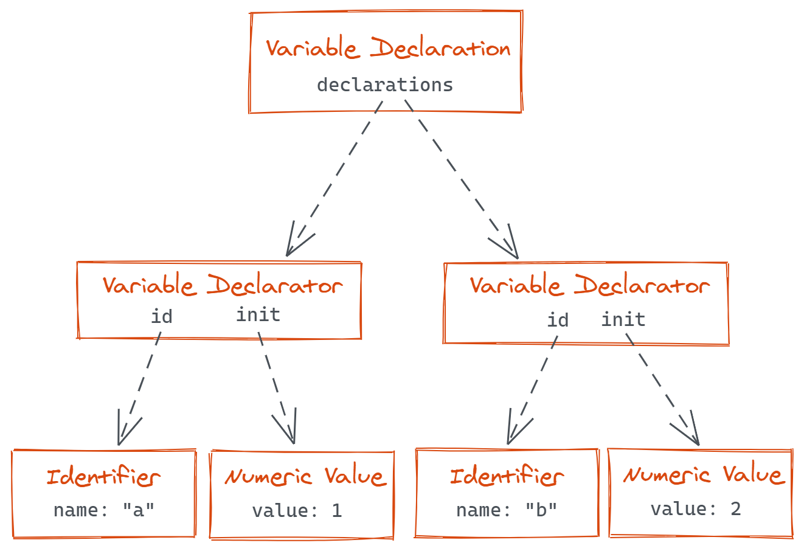

Since originally writing about
[creating a custom transform with jscodeshift](/jscodeshift-custom-transform),
I've had the opportunity to write many more. In the process, I've settled 
into a standard workflow for creating codemods when approaching new problems.

On the surface, codemods seem daunting, particularly dealing with 
the abstract syntax tree. But with the right tools and workflow,
it can become a breeze. By the end of this post, you should be
comfortable with the basics of understanding how to interact with
the abstract syntax tree, differences between auditing and
transforming code, and a few invaluable tools.

## Workflow

The first question I ask is whether I'm trying to audit code, or
trying to transform (codemod) code. A code audit is useful for 
understanding the current state of the code without making changes. 
On the other hand, a code transform is useful for making 
changes to existing code.

For example, say there is a function. If you'd like to know how
many times that function is used, or which arguments are passed,
this is an audit. If you'd like to rename the function, or
change the order of arguments, this is a transform.

You might be wondering how code audits are related, or why
it's included. Code audits were a concept that I never
considered before I started working with codemods. They
both conceptually start off in the same way: trying to
find a specific piece of code. However, they differ
in the output: a transform changes the code while an
audit aggregates information about the code usage.

### Auditing versus Transforming

For code audits, I reach for [`@babel/parser`](https://babeljs.io/docs/en/babel-parser)
and [`@babel/traverse`](https://babeljs.io/docs/en/babel-traverse).
This approach requires combining a few packages, but this means it's
more flexible. It works particularly well for keeping track of things _across_ files.

For code transforms, I reach for [`jscodeshift`](https://github.com/facebook/jscodeshift).
This is an all-in-one tool and doesn't require pulling in additional 
packages but means it's specialized only for transforming code, and 
not as flexible for other tasks like code audits. Depending on the
exact configuration, it will actually use `@babel/parser` under-the-hood.

### Understanding the Abstract Syntax Tree

With either approach, the first step is to understand the code
you're working with. Both tools convert a string of code into
an abstract syntax tree (AST). This is a fancy name for creating
a tree data structure with each node in the tree representing a
specific piece of the code. 

For example, let's say the following code is parsed with `@babel/parser`:

```js
const a = 1, b = 2;
```

This code would produce a tree structure roughly like this:



In this example, the entire snippet is a single variable declaration, 
and it declares two variables (variable declarators). Each of these
declared variables have a name (identifier) and a value (in this case,
a numeric value).

The exact tree structure may differ depending on the parser,
but the important part is understanding that this is essentially
all there is to an abstract syntax tree. While the exact names
and structure might seem complex, it's not important
to memorize these since the AST for any code snippet can be quickly 
explored using [astexplorer.net](https://astexplorer.net).

This tool is invaluable to understand the AST for a given piece
of code. One mistake I commonly make is forgetting to change the
parser, make sure this aligns with the parser you're using
otherwise you can end up with different trees.

### Writing the code

Now we've picked the right parser, and have a high level understanding of
the AST for the code snippet we care about. It's time to actually
write the code. As seen, the AST names and structure can be complex.
As a result, it's easy to make a typo when working with properties
and node names, or forget to check that the node is the correct type.

For example, in the above code snippet it might seem like the `init`
property for the variable decelerator always points to a numeric value.
While it's true for this example, that's not always the case.

```js
const a = 1, b = init();
```

This updated code snippet initializes `b` with a function instead of a
numeric value. The `init` property will now point to a "call expression"
node (not a "numeric value" node). If you only care about one of these,
it's important to check the node's type before accessing properties
since many properties only exist on specific types of nodes. Including
these checks can be easy to overlook.

Fortunately, when working with `jscodeshift` the 
[`@types/jscodeshift`](https://www.npmjs.com/package/@types/jscodeshift)
package provides type definitions which can help solve both these problems
by leveraging TypeScript. First, it will catch any typos when working
with nodes. Second, it will validate that the node is only the type
you expect and will raise a type error otherwise. 

## Examples

Now that the steps have been outlined, what does this look like in practice?

### Code Audit

Let's start with a code audit.

### Code Transform

If you're looking for a much more in-depth example

<div class="notice" role="alert">
Looking for a more in-depth tranform example? Check out this post about
<a href="/jscodeshift-custom-transform">transforming Font Awesome component usages</a>.
</div>

## Conclusion

This was a walk-through of my general workflow for auditing
and transforming code. What works best for you might be
a bit different, but hopefully this provides some useful
tools and approaches for the next time you're working with code.