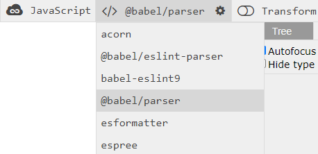

Since originally writing about
[creating a custom transform with jscodeshift](/jscodeshift-custom-transform),
I've had the opportunity to write many more. In the process, I've settled
into a standard workflow for creating codemods when approaching new problems.

On the surface, codemods seem daunting, particularly dealing with
the abstract syntax tree. But with the right tools and workflow,
it can become a breeze. By the end of this post, you should be
comfortable with the basics of understanding how to interact with
the abstract syntax tree, differences between auditing and
transforming code, and a few invaluable tools.

## Workflow

The first question I ask is whether I'm trying to audit code, or
trying to transform (codemod) code. A code audit is useful for
understanding the current state of the code without making changes.
On the other hand, a code transform is useful for making
changes to existing code.

For example, say there is a function. If you'd like to know how
many times that function is used, or which arguments are passed,
this is an audit. If you'd like to rename the function, or
change the order of arguments, this is a transform.

You might be wondering how code audits are related and why
it's included in a post about codemods. Code audits were a
concept that I never considered before I started working with
codemods. They both start off in the same way: find a specific
piece of code. They differ only in output: an audit aggregates
information about the code usage, while a transform changes
the code. Often, I'll do a code audit to understand the current
state of the code in aggregate before making any changes, because
it surfaces important information and often influences how I
approach making changes to the code. Fortunately, this also means
most of the code can be reused between the two since they both
target the same piece of code.

### Auditing versus Transforming

For code audits, I start with [`@babel/parser`](https://babeljs.io/docs/en/babel-parser)
and [`@babel/traverse`](https://babeljs.io/docs/en/babel-traverse).
This approach requires combining a few packages, but this means it's
more flexible. It works particularly well for keeping track of things
_across_ files.

For code transforms, I reach for [`jscodeshift`](https://github.com/facebook/jscodeshift).
This is an all-in-one tool and doesn't require pulling in additional
packages but means it's specialized only for transforming code, and
not as flexible for other tasks like code audits. Depending on the
[exact configuration](https://github.com/facebook/jscodeshift#parser),
it may actually use `@babel/parser` under-the-hood.

### Understanding the Abstract Syntax Tree

With either approach, the first step is to understand the code
you're working with. Both tools convert a string of code into
an abstract syntax tree (AST). This is a fancy name for creating
a tree data structure with each node in the tree representing a
specific piece of the code.

For example, let's say the following code is parsed with `@babel/parser`:

```js
const a = 1,
  b = 2;
```

It will produce the following JSON structure. Note that many of the
properties have been removed for readability, but the structure is
intact.

```json
{
  "type": "VariableDeclaration",
  "declarations": [
    {
      "type": "VariableDeclarator",
      "id": {
        "type": "Identifier",
        "name": "a"
      },
      "init": {
        "type": "NumericLiteral",
        "value": 1
      }
    },
    {
      "type": "VariableDeclarator",
      "id": {
        "type": "Identifier",
        "name": "b"
      },
      "init": {
        "type": "NumericLiteral",
        "value": 2
      }
    }
  ],
  "kind": "const"
}
```

In a more visual representation, that would produce the following tree structure.


In this example, the entire snippet is a single variable declaration,
and it declares two variables (variable declarators). Each of these
declared variables have a name (identifier) and a value (in this case,
a numeric value).

The exact tree structure may differ depending on the parser,
but the important part is understanding that this is the
abstract syntax tree we'll be working with. While the exact names
and structure might seem complex, it's not important
to memorize these since the AST for any code snippet can be quickly
explored using [astexplorer.net](https://astexplorer.net).

This tool is invaluable to understand the AST for a given piece
of code. One mistake I commonly make is forgetting to change the
parser in AST Explorer, make sure this aligns with the parser you're using
otherwise you can end up with different trees.

### Writing the code

Now we've picked the right parser, and have a high level understanding of
the AST for the code snippet we care about. It's time to actually
write the code. As seen, the AST names and structure can be complex.
As a result, it's easy to make a typo when working with properties
and node names, or forget to check that the node is the correct type.

For example, in the above code snippet it might seem like the `init`
property for the variable decelerator always points to a numeric value.
While it's true for this example, that's not always the case.

```js
const a = 1,
  b = init();
```

This updated code snippet initializes `b` with a function instead of a
numeric value. The `init` property will now point to a "call expression"
node (not a "numeric value" node). If you only care about one of these,
it's important to check the node's type before accessing properties
since many properties only exist on specific types of nodes. Including
these checks can be easy to overlook. This may not be an issue in
smaller codebases, but becomes a real issue in larger codebases.

Fortunately, both approaches have type definitions available:

- [`@types/babel__traverse`](https://www.npmjs.com/package/@types/babel__traverse) - when working with `@babel/traverse`
- [`@types/jscodeshift`](https://www.npmjs.com/package/@types/jscodeshift) - when working with `jscodeshift`

Both these packages provide type definitions which can help avoid
these problems. First, it will catch any typos when working
with nodes. Second, it will validate that the node is only the type
you expect and will raise a type error otherwise.

## Example

Now that the steps have been outlined, what does this look like
in practice? Let's start by defining a simple `coffee` object with
a property to `brew` coffee.

```js
// coffee.js
export const coffee = {
  brew: (water, grounds) => {
    if (water && grounds) {
      return "☕";
    }
  }
};
```

This is then used in a few files, to make a few cups of coffee. ☕

```js
// src/firstCup.js
import { coffee } from "./coffee";

export const firstCup = coffee.brew("💧", "💩");
```

```js
// src/secondCup.js
import { coffee } from "./coffee";

export const secondCup = coffee.brew("🌊", "💩");
```

```js
// src/thirdCup.js
import { coffee } from "./coffee";

export const thirdCup = coffee.brew("🚿", "💩");
```

After a while, we realize there are a couple of ways
the function is being used. Specifically, several
different types of `water`. We decide that we want to
update `brew` to only accept one type of water.

```js
export const coffee = {
  brew: (water, grounds) => {
    if (water === "???" && grounds) {
      return "☕";
    }
  }
};
```

Before choosing which `water` argument to allow, lets understand how
it's used today. If most usages already use the same water argument,
it makes the most sense to use that one. Otherwise, any can be chosen.

### Code Audit

To start auditing the code, let's install the babel packages
along with a few others to help with reading files and executing the code.

- [`@babel/parser`](https://babeljs.io/docs/en/babel-parser) - parse a string of code into an AST
- [`@babel/traverse`](https://babeljs.io/docs/en/babel-traverse) _([and types](https://www.npmjs.com/package/@types/babel__traverse))_ - helps traverse the AST and find specific nodes
- [`glob`](https://www.npmjs.com/package/glob) _([and types](https://www.npmjs.com/package/@types/glob))_ - easily find the files using glob patterns
- [`ts-node`](https://www.npmjs.com/package/ts-node) - replacement for node capable of handling TypeScript files
- [`typescript`](https://www.npmjs.com/package/typescript) - required for TypeScript support

This list doesn't include [`fs`](https://nodejs.org/api/fs.html) because it's provided
by `node`. Now we can put together a script to read our code and find a specific piece.

```typescript
// audit.ts
import { parse } from "@babel/parser";
import traverse from "@babel/traverse";
import * as fs from "fs";
import * as glob from "glob";

// Find all files relevant files.
const files = glob.sync("./src/*.js");

files.forEach(file => {
  const contents = fs.readFileSync(file).toString();

  const ast = parse(contents, {
    sourceType: "module",
    plugins: [
      // Note: depending on the code being parsed, you
      // may need to add plugins such as `jsx`
      // https://babeljs.io/docs/en/babel-parser#plugins
    ]
  });

  traverse(ast, {
    // Find the code we care about...
  });
});
```

This script template will find all files matching the
specified glob pattern (all `.js` files in the `src` directory).
For each of those files that is found, it then reads
that file's contents. The contents is still a string,
so the next step is to `parse` it and generate an
abstract syntax tree. Finally, we're ready to `traverse`
that tree. 

The next step is to figure out how to traverse the tree to
find the specific piece of code we care about. This is 
where [astexplorer.net](https://astexplorer.net)
comes into play. First, checking that the parser is
correct.



Then, pasting in a sample code snippet that we're looking for.

```
coffee.brew("💧", "💩")
```

Note that removing as much of the irrelevant code as possible
(eg: the `export` and `const` variable deceleration) 
can help simplify understanding the AST. Again, with some
of the properties removed for readability, this code produces
the following JSON representing the AST.

```json
{
  "type": "ExpressionStatement",
  "expression": {
    "type": "CallExpression",
    "callee": {
      "type": "MemberExpression",
      "object": {
        "type": "Identifier",
        "name": "coffee"
      },
      "computed": false,
      "property": {
        "type": "Identifier",
        "name": "brew"
      }
    },
    "arguments": [
      {
        "type": "StringLiteral",
        "value": "💧"
      },
      {
        "type": "StringLiteral",
        "value": "💩"
      }
    ]
  }
}
```

Before writing any code, we can state what we're looking
for based on this AST:

> We want to know the `arguments` of a `CallExpression` node,
> where the `callee.object.name` is `coffee` and the
> `callee.property.name` is `brew`.

There are a number of ways this can be done with `traverse`, but my
general approach is to take the type of the highest node in the
tree that is specific to the code I care about  and use that as 
the entrypoint. In this case, that's `CallExpression`.

```ts
// audit.ts
traverse(ast, {
  CallExpression(path) {
    const { node } = path;
  }
});
```

As the AST is being traverse, any `CallExpression` nodes will be
passed to this function. It actually passes a `path` which has
a `node` property that corresponds to the node in the AST.
The `path` is a wrapper with some other metadata, such
as the `parent` node that can be helpful to traverse up the tree
if needed.

So now we have the `CallExpression` node, but the above
description had several other constraints, so let's
apply all of those.

```ts
// audit.ts
traverse(ast, {
  CallExpression(path) {
    const { node } = path;

    if (
      node.callee.object.name === "coffee" &&
      node.callee.property.name === "brew"
    ) {
      console.log(node.arguments);
    }
  }
});
```

Great, this finds exactly what we care about,
which parameters are being passed to `coffee.brew`.
For this example, we could completely stop here.
However, once this reaches hundreds of files, there are
likely two problems to emerge. First, `node.callee.type`
could be something other than a `MemberExpression`,
which means `node.callee.object.name` or `node.callee.property.name`
may not always exist. That means this could throw a runtime
error. Fortunately, this file was written in TypeScript and
the corresponding type definitions were installed. This
means that several type errors are actually being
thrown with the current solution.

```typescript
traverse(ast, {
  CallExpression(path) {
    const { node } = path;

    if (
      node.callee.object.name === "coffee" &&
      //          ^^^^^^
      // Property 'object' does not exist on type
      // 'ArrayExpression | ... 44 more ... | V8IntrinsicIdentifier'.
      node.callee.property.name === "brew"
      //          ^^^^^^^^
      // Property 'property' does not exist on type
      // 'ArrayExpression | ... 44 more ... | V8IntrinsicIdentifier'
    ) {
      console.log(node.arguments);
    }
  }
});
```

Fixing these type errors also results in a much more robust script
because each node's type is verified before any properties are accessed.
This prevents unexpected runtime error such as trying to read a property
of `undefined`.

```typescript
traverse(ast, {
  CallExpression(path) {
    const { node } = path;

    if (
      node.callee.type === "MemberExpression" &&
      node.callee.object.type === "Identifier" &&
      node.callee.object.name === "coffee" &&
      node.callee.property.type === "Identifier" &&
      node.callee.property.name === "brew"
    ) {
      console.log(node.arguments);
    }
  }
});
```

Second, the arguments are being logged to the console.
This is going to be very noisy and almost impossible to
determine the most used. For this, we can create a global
object and increment counters for different values. In this
case, since we care about two parameter values, an array
with two corresponding objects can be added with logic
to increment a counter each time an argument is used in
that position.

```typescript
import { parse } from "@babel/parser";
import traverse from "@babel/traverse";
import * as fs from "fs";
import * as glob from "glob";

// Keep track of which args are passed to `coffee.brew`.
const args = [
  {}, // tracks first argument
  {} // tracks second argument
];

// Find all files relevant files.
const files = glob.sync("./src/*.js");

files.forEach(file => {
  const contents = fs.readFileSync(file).toString();

  const ast = parse(contents, {
    sourceType: "module",
    plugins: []
  });

  traverse(ast, {
    CallExpression(path) {
      const { node } = path;

      if (
        node.callee.type === "MemberExpression" &&
        node.callee.object.type === "Identifier" &&
        node.callee.object.name === "coffee" &&
        node.callee.property.type === "Identifier" &&
        node.callee.property.name === "brew"
      ) {
        node.arguments.forEach((argument, index) => {
          if (argument.type !== "StringLiteral") return;

          const { value } = argument;
          if (args[index][value]) {
            args[index][value] += 1;
          } else {
            args[index][value] = 1;
          }
        });
      }
    }
  });
});

console.log(args);
```

Running this (`yarn ts-node ./audit.ts`) complete script now logs the following.

```json
[{ "💧": 1, "🌊": 1, "🚿": 1 }, { "💩": 3 }]
```

With this output, we can now say how the existing code
was used. There were three invocations of `coffee.brew`,
with three different water arguments, always the
same coffee grounds argument. Let's pick `"💧"` as
the only permitted option and update the original
function.

```js
// src/coffee.js
export const coffee = {
  brew: (water, grounds) => {
    if (water === "💧" && grounds) {
      return "☕";
    }
  },
};
```

### Code Transform

Now there's a problem, two out of the three usages will
no longer properly brew coffee. For this example, the
quickest fix is to manually update the two files. For the
purposes of this example, lets imagine this is actually
across hundreds of files. Not only will it take a long time,
it can be challenging to keep it all in your head, and the
chances of making a mistake increases with each file. Instead,
we can create a codemod because it can be ran across any
number of files and make the changes reliably.

To get started, only one new dependency needs to be added.

- [`jscodeshift`](https://github.com/facebook/jscodeshift) _([and types](https://www.npmjs.com/package/@types/jscodeshift))_ - toolkit for running codemods

Now, we can create a file named `transform.ts` to contain
our codemod, or transformation with the basics.

```ts
// transform.ts
import { Transform } from "jscodeshift";

const transform: Transform = (file, api) => {
  // Alias the jscodeshift API for ease of use.
  const j = api.jscodeshift;

  // Convert the entire file source into a collection of nodes paths.
  const root = j(file.source);

  return root.toSource();
};

export default transform;
```

This sets up a jscodeshift transform as the default export. It's
also importing the `Transform` type so that all the parameters and
therefore the internals are properly typed. The parameters are defined
and passed in by jscodeshift. This transform creates an alias for the
jscodeshift API (`j`) since it can be referenced many times depending on the
complexity of the transform. Then, it's taking the file source string
and converting it into an AST with a reference to it's `root`. Finally,
it's converting the AST back into a source string which will get written
back to the file. Right now, this will be identical to what already exists 
in the files. To make the transformation, the AST can be mutated before 
it's converted back to a source string.

```ts
// transform.ts
import { Transform } from "jscodeshift";

const transform: Transform = (file, api) => {
  // Alias the jscodeshift API for ease of use.
  const j = api.jscodeshift;

  // Convert the entire file source into a collection of nodes paths.
  const root = j(file.source);

  root.find(j.CallExpression).filter(path => {
    const { node } = path;

    if (
      node.callee.type === "MemberExpression" &&
      node.callee.object.type === "Identifier" &&
      node.callee.object.name === "coffee" &&
      node.callee.property.type === "Identifier" &&
      node.callee.property.name === "brew"
    ) {
      // ...
    }
  });

  return root.toSource();
};

export default transform;
```

```ts
// transform.ts
import { Transform } from "jscodeshift";

const transform: Transform = (file, api) => {
  // Alias the jscodeshift API for ease of use.
  const j = api.jscodeshift;

  // Convert the entire file source into a collection of nodes paths.
  const root = j(file.source);

  root
    .find(j.CallExpression)
    .filter(path => {
      const { node } = path;

      if (
        node.callee.type === "MemberExpression" &&
        node.callee.object.type === "Identifier" &&
        node.callee.object.name === "coffee" &&
        node.callee.property.type === "Identifier" &&
        node.callee.property.name === "brew"
      ) {
        const [waterArg] = node.arguments;
        return waterArg.type === "Literal" && waterArg.value !== "💧";
      }
    })
    .replaceWith(path => {
      const { node } = path;

      const [waterArg] = node.arguments;
      if (waterArg.type === "Literal") {
        waterArg.value = "💧";
      }

      return node;
    });

  return root.toSource();
};

export default transform;
```

<div class="notice" role="alert">
Looking for an in-depth, real-world codemod transform? Check out this post about
<a href="/jscodeshift-custom-transform">transforming Font Awesome components</a>.
</div>

## Conclusion

This was a walk-through of my general workflow for auditing
and transforming code. What works best for you might be
a bit different, but hopefully this provides some useful
tools and approaches for the next time you're working with code.

All of [this code can be found on GitHub](https://github.com/skovy/typescript-codemod-examples).
