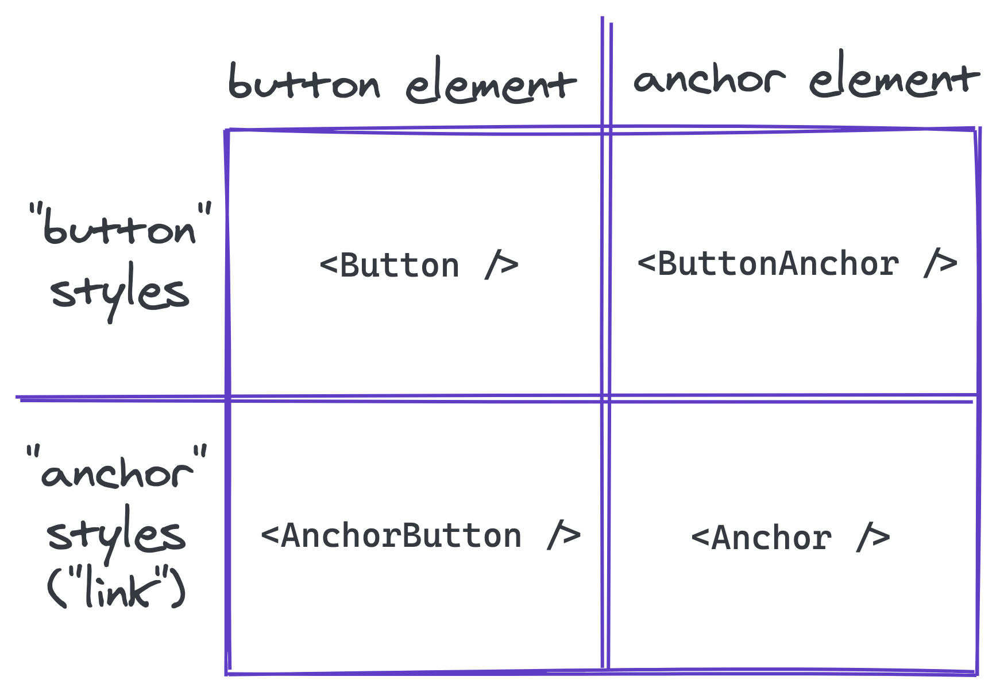

When working on reusable components, such as those in a design system, it
can be common for a component to contain what seems like a single functionality,
such as a `Button` component. It's functionality is generally to perform an
action. However, if that action opens a dialog, it should probably be a `button`
element, whereas if that action navigates to a new page it should probably
be an `a` (anchor) element.

There are a number of ways this could be handled. In this example, it could be
inferred if an `href` prop is present. Or, there could be a boolean prop
such as `isAnchor` or `isButton` to opt-in, and default to the other element.
Either of these could work with this example, but what about another component
that may need to support three or more element types? Or, what if there isn't
a prop such as `href` that can imply the element type?

<div class="notice" role="alert">
Prefer to watch a video instead of reading? Check out this video below that
covers the same topic! <span role="img" aria-label="pointing down">👇</span>
</div>

`youtube: https://www.youtube.com/watch?v=8XcYt3El08Y`

## The `as` prop

As you can see with only this one example, it's hard to expand any of these
patterns more generally. This is where the `as` prop pattern can help solve
these issues, and provide a general solution for most components.

Continuing with this `Button` example, how would this look using the `as` prop?

```typescript
interface ButtonProps {
  as: "a" | "button";
}

const Button: React.FC<ButtonProps> = ({ as: Tag, children }) => (
  <Tag>{children}</Tag>
);

// Example usage:
//  <Button as="button">Click me!</Button>
//  <Button as="a">Click me!</Button>
```

Here, a `Button` component is defined with two props: `as` and `children`.
The `children` prop controls the `Button` contents to display. The `as` prop controls
the rendered element, or HTML tag. Now there is a single component to capture
an action, but the proper semantic element can be controlled depending on the use
case.

There are several problems with this example. For example, it doesn't accept
the proper `onClick` or `href` attributes for `button` and `a` elements.

It may also seem tedious to make the `as` prop required, and it could be tempting
to assign a default value for the `as` prop and make it optional.

```typescript
interface ButtonProps {
  as?: "a" | "button";
}

const Button: React.FC<ButtonProps> = ({ as: Tag = "button", children }) => (
  <Tag>{children}</Tag>
);

// Example usage:
//  <Button">Click me!</Button>
//  <Button" as="a">Click me!</Button>
```

This can work for simple cases, but we'll cover a few reasons _(accessibility
and type-safety)_ why it can be preferable to make it required.

## Advantages

The primary advantage of the `as` prop is that it decouples a component's
visual appearance and functionality from the semantic markup.

For example, let's say there are unique styles for a "button" and an "anchor" (or a "link").
The "button" likely has some padding and a background color, whereas the "anchor" probably
has an underline. However, there are _some_ cases that need to look like an
"anchor" but are semantically a `button` element. There needs to be a component to
handle this use case: a `button` element that looks like an "anchor." What about the
reverse? An anchor element that looks like a "button"?

Based on these examples, it starts too look like a two by two matrix with the
appearance ("button" or "anchor" styling) on one axis, and the semantic element
(`button` or `a`) on the other axis. This results in four combinations and could
each be treated as their own component: `Button`, `ButtonAnchor`, `Anchor`,
`AnchorButton`.



<span class="image-caption">
Example matrix of different styling and element combinations
</span>

This naming could be improved, but it's confusing which to use
in which case? Does the styling, or element type have precedence in the naming?
Also, nearly identical functionality and styling are now duplicated across these
components.

Instead, if all styles were combined as a single prop (eg: `variant`), then the
proper element can be controlled via the `as` prop on a single `Button` component
to handle all of these us.

```tsx
// Looks like an "anchor" ("link") but is a `button` element
<Button as="button" variant="link">Click me!</Button>

// Looks like a "button" but is an `a` (anchor) element
<Button as="a" variant="secondary">Click me!</Button>
```

Additionally, this can also help improve accessibility. For example, a `Heading`
component will need to render different typography styles and should also render
an appropriate heading element (`h1` - `h6`). Often, global styles will be
applied to each heading element, meaning the heading is chosen for it's visual
appearance, which may or may not properly align with the page's hierarchy.
If used incorrectly, this can harm the page's accessibility. Instead, by
decoupling the visual appearance from the semantic meaning this problem can be
alleviated.

```tsx
<Heading as="h1" size="1">Heading Level 1</Heading>
<Heading as="h2" size="2">Heading Level 2</Heading>
<Heading as="h2" size="1">Heading Level 2 (but looks like 1)</Heading>
```

Any visual appearance can now be used with any element. In general, the `as`
prop and `size` prop will usually align (`h1` as size `1`) but there can be
cases where this may not be true. With this API, it's now possible to mix the visual
appearance with the proper underlying element. It might be tempting to default
`as` based on `size`. For example, if `size` is `1`, default to `h1`. However,
by making it required, every usage now requires asking two questions: "what
should this element be?" and "how should this look?". Each answer maps directly
to these props. Relying on global heading element styles, or relying on a single
prop combines these two questions into a single answer. This usually leads to
picking the correct visual appearance, and neglecting the proper semantic element.

## Disadvantages

The biggest disadvantage is that it's one more prop, which increases the surface
area of the API. It can also feel potentially redundant (eg: `<Button as="button"/>`).
As discussed, this can be preferable to always ask: "what should this element be?"
and require an explicit decision. Finally, the name `as` may not be clear enough
for some. Other names such as `element` can be used to achieve the same result.
The most important thing is consistency across a shared set of components
(eg: `Button` and `Heading`). I prefer `as`, because it easily translates to a
sentence, which I generally use as a smoke test for component and prop naming.
For example, `<Button as="a" />` roughly reads as "render a Button as an anchor."

## Discriminated Props with TypeScript

This section covers how to implement a basic React component with TypeScript
using the `as` prop pattern. Specifically, when the exact props allowed depend
on the `as` prop. For example, with the `Button`, `href` is required when, and
only when `as` is `"a"` (an anchor element).

This can be achieved in TypeScript using a [discriminated union](https://www.typescriptlang.org/docs/handbook/unions-and-intersections.html#discriminating-unions). The `as`
prop needs to be required for the following example to work as expected.

```tsx
interface ButtonSharedProps {
  variant?: "primary" | "secondary" | "link";
  // additional shared props...
}

interface AnchorElementProps extends ButtonSharedProps {
  as: "a";
  href: string;
  // additional anchor-specific props...
}

interface ButtonElementProps extends ButtonSharedProps {
  as: "button";
  onClick(): void;
  // additional button-specific props...
}

type ButtonProps = AnchorElementProps | ButtonElementProps;

const Button: React.FC<ButtonProps> = props => {
  const { children, variant = "primary" } = props;

  switch (props.as) {
    case "a": {
      const { href } = props;

      return (
        <a href={href} className={variant}>
          {children}
        </a>
      );
    }
    case "button": {
      const { onClick } = props;

      return (
        <button onClick={onClick} className={variant}>
          {children}
        </button>
      );
    }
    default:
      // consider adding an exhaustiveness check
      // (see discriminated union docs)
      return null;
  }
};
```

Now the `ButtonProps` is a union of two different types: `AnchorElementProps`
and `ButtonElementProps`. They both have an `as` prop with literal values
`"a"` and `"button"`, respectively. The `as` prop can then be used within the
component to differentiate between the two types and allow TypeScript to
narrow to the correct type. For example, in the first `case` for `"a"`, TypeScript
now knows the `href` prop _must_ be present. This allows accepting and requiring
props only valid for specific element types.

```tsx
<Button as="a">Click me!</Button>
// ^^^^ Property 'href' is missing (type error)

<Button as="button" href="test">Click me!</Button>
//                  ^^^^ Property 'href' does not exist (type error)
```

Anything that is common, for example the `variant` prop which controls the
visual appearance, can be added to the `ButtonSharedProps` interface.

Now, `Button` can render any visual appearance, and render any valid semantic
element, while only allowing props valid for that specific element.

## Conclusion

It took me some time to see the value in the `as` prop pattern. Now in hindsight,
it seems like an obvious choice decoupling a component's visual appearance from
it's semantic meaning.

This post only covered two examples, `Button` and `Heading`, but there are
countless others. Next time you run into a problem where a component has the
desired visual appearance and functionality, but renders the incorrect semantic
element for the use case, consider reaching for the `as` prop pattern.
