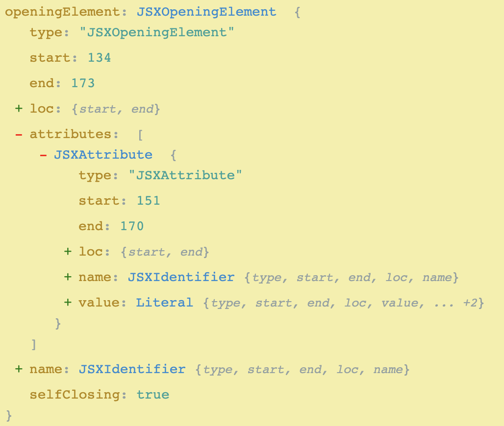

In recent React versions, there is a warning when using
[deprecated lifecycle methods](https://reactjs.org/blog/2019/08/08/react-v16.9.0.html#renaming-unsafe-lifecycle-methods)
to run the [`rename-unsafe-lifecycles`](https://github.com/reactjs/react-codemod#rename-unsafe-lifecycles)
codemod. This will prefix all the unsafe lifecycle methods with the appropriate
`UNSAFE_` prefix. For example, `componentWillMount` &#8594; `UNSAFE_componentWillMount`.

However, it [took](https://github.com/reactjs/react-codemod/pull/228)
[some](https://github.com/reactjs/react-codemod/pull/234)
[effort](https://github.com/reactjs/react-codemod/pull/236) to get the
[`react-codemod`](https://github.com/reactjs/react-codemod)
to work properly in a TypeScript React app. In the process of investigating,
I came across [`jscodeshift`](https://github.com/facebook/jscodeshift), a
JavaScript codemod toolkit which is used to perform the React codemods.
It's a powerful tool when needing to make large sweeping changes that
can be done mechanically following a set of rules.

## The Problem

I didn't immediately have a use case for using `jscodeshift`. However, in the
process of trying to reduce overall bundle size in an application, I ran into a
problem where every Font Awesome icon was being included in the bundle.

This was a result of importing the entire icon library for each icon set.

```typescript
import { library } from "@fortawesome/fontawesome-svg-core";
import { fas } from "@fortawesome/free-solid-svg-icons";

library.add(fas);
```

The full problem and its implications can be read in
[the previous post about tree shaking Font Awesome](/tree-shaking-font-awesome/).

However, to fix this, all the "implicit" references to icons had to be made
"explicit" so webpack could properly tree shake the unused icons. That meant
that all the code that referenced string icons needed to be replaced with
an explicit import from Font Awesome.

```typescript
// Before
<FontAwesomeIcon icon="coffee" />
```

```typescript
// After
import { faCoffee } from "@fortawesome/free-solid-svg-icons";

<FontAwesomeIcon icon={faCoffee} />;
```

Depending on the exact number of icons being used, **this can result in a 90%+
reduction** in the amount of code from Font Awesome. After months of using the
implicit string approach there were thousands icons referenced this way.

One option was to global search references of this component, manually convert
`"coffee"` to `faCoffee`, add the import, deal with de-duplicating imports, and
handling icons with the same name being imported from multiple icon packages.
This would likely take days and inevitably result in some error (likely switching
and icon for another).

Since this was a very repetitive problem with a well defined set of rules,
creating a custom transform for jscodeshift seemed like a great option.

## Getting Started

The bare minimum to get started is to define a transform. A transform is a file
where the default export is a function that accepts the file info, the jscodeshift
API, and finally any custom options.

The transforms [can be written in TypeScript](https://github.com/facebook/jscodeshift/pull/287) which can be helpful to ensure proper usage of the jscodeshift API when first starting.

```typescript
// transforms/implicit-icons-to-explicit-imports.ts
import { Transform } from "jscodeshift";

const transform: Transform = (file, api, options) => {
  return null;
};

export default transform;
```

Now, to run and test this, the development dependencies can be added.

```bash
yarn add -D jscodeshift @types/jscodeshift
```

Then, a test file to run the transform against.

```typescript
// transforms/__testfixtures__/implicit-icons-to-explicit-imports/basic.input.tsx
import * as React from "react";
import { FontAwesomeIcon } from "@fortawesome/react-fontawesome";

const Component = () => {
  return <FontAwesomeIcon icon="minus-circle" />;
};
```

Finally, the transform can be ran.

```bash
yarn jscodeshift -t transforms/implicit-icons-to-explicit-imports.ts transforms/__testfixtures__/implicit-icons-to-explicit-imports/array.input.tsx --dry --print
```

The [`--dry`](https://github.com/facebook/jscodeshift#usage-cli) and
[`--print`](https://github.com/facebook/jscodeshift#usage-cli) options will run
the transform without overwriting the file and print the would-be-result to
the console instead. The command will run successfully, but it won't print
anything because the transform doesn't perform any transformations.

Before diving into the transform, it will become tedious to continue running
this command (or others) repeatedly. The jscodeshift package ships with a
useful test utility: [`defineTest`](https://github.com/facebook/jscodeshift#definetest).
This can be used with a test runner like [`jest`](https://jestjs.io/) to validate
input against the expected output for a transform.

```typescript
// transforms/__tests__/implicit-icons-to-explicit-imports.ts
import { defineTest } from "jscodeshift/dist/testUtils";

describe("implicit-icons-to-explicit-imports", () => {
  defineTest(
    __dirname,
    "implicit-icons-to-explicit-imports",
    null,
    `implicit-icons-to-explicit-imports/basic`,
    { parser: "tsx" }
  );
});
```

> This last option (`{ parser: "tsx" }`) depends on
> [an open pull request](https://github.com/facebook/jscodeshift/pull/332)
> to add support for running against TypeScript files.

The `defineTest` helpers requires a [specific directory structure](https://github.com/facebook/jscodeshift#unit-testing)
so it can find the correct files.

```bash
# The transform file
transforms/implicit-icons-to-explicit-imports.ts

# The test file
transforms/__tests__/implicit-icons-to-explicit-imports.ts

# The input/output pairing to run the transform against
transforms/__testfixtures__/implicit-icons-to-explicit-imports/basic.input.tsx
transforms/__testfixtures__/implicit-icons-to-explicit-imports/basic.output.tsx
```

For more advanced testing examples, [see the tests for this transform](https://github.com/skovy/font-awesome-codemod/blob/master/transforms/__tests__/implicit-icons-to-explicit-imports.ts)
or the [React codemods](https://github.com/reactjs/react-codemod/tree/master/transforms/__tests__).

Now, as changes are made to the transform they can be easily tested to validate
the input and expected output.

## Filling the transform

The first thing to be aware of when making a transform is that jscodeshift
is actually built on top of several other tools. This is an important detail
because it may be helpful to reference their documentation as well.

[`recast`](https://github.com/benjamn/recast) is used for transforming the code
from test into something that can be worked with programmatically. This 
intermediary tree structure that represents the parsed code is commonly 
referred to as an [abstract syntax tree](https://en.wikipedia.org/wiki/Abstract_syntax_tree) (AST).

This package itself depends on [`ast-types`](https://github.com/benjamn/ast-types)
to represent the individual nodes and types in the abstract syntax tree.

It's not necessary to look at either of these packages but it can be helpful
depending on the complexity of a transform.

To start, let's use the example from above. We know we have a component named
`FontAwesomeIcon` with a prop named `icon`.

Unfortunately, jscodeshift doesn't have great documentation and requires a bit
of "source-diving" to find the methods you may need. It offers the 
[`findJSXElements`](https://github.com/facebook/jscodeshift/blob/a268d0d1b96624427dddc2f1f4e65837b105031b/src/collections/JSXElement.js#L29-L38)
which will find all the JSXElements filtered by the name passed. This will
give us the correct component(s), but the `FontAwesomeIcon` component could have
a set of other props.

To narrow down to only the prop we care about, we can use the
[`find`](https://github.com/facebook/jscodeshift/blob/d63aa8486c2099a65b071e7c86e9dccdb8577d80/src/collections/Node.js#L25-L57)
method to find nodes of a specific type. The specific type of the node we're
looking for is a 
[`JSXAttribute`](https://github.com/benjamn/ast-types/blob/0b6bc6dec16203076e3a0ffca0157c9215ec14f9/gen/namedTypes.ts#L527-L531).
This type is [defined in `ast-types`](https://github.com/benjamn/ast-types/blob/28c73fa503f070512a89e7cd1bc5ed97eacf173b/def/jsx.ts#L15-L23).

But how do you know it's `JSXAttribute` in the first place? 
[astexplorer.net](https://astexplorer.net) is an invaluable resource to
understand the AST that represents a piece of code.



This screenshot is an example of what the above code would look like if pasted
into the AST explorer. This is how we know we needed to narrow down to only
the `JSXAttribute` nodes.

```typescript
import { Transform } from "jscodeshift";
import { camelCase } from "change-case";

const transform: Transform = (file, api, options) => {
  // Alias the jscodeshift API for ease of use.
  const j = api.jscodeshift;

  // Convert the entire file source into a collection of nodes paths.
  const root = j(file.source);

  root
    // Find all JSX elements with the name FontAwesomeIcon...
    .findJSXElements("FontAwesomeIcon")
    // with an `icon` prop with a string value...
    .find(j.JSXAttribute, {
      name: {
        type: "JSXIdentifier",
        name: "icon"
      },
      value: {
        type: "StringLiteral"
      }
    })
    // narrowed down to that string value (eg: `user`)...
    .find(j.StringLiteral)
    // and replace the existing node...
    .replaceWith(nodePath => {
      const { node } = nodePath;

      // eg: "minus-circle" -> "faMinusCircle"
      const iconDefinition = camelCase(`fa-${node.value}`);

      // with a new JSX expression with the icon definition.
      return j.jsxExpressionContainer(j.identifier(iconDefinition));
    });

  return root.toSource();
};

export default transform;
```

> The component name and prop name are hard-coded in this example, but the
> [`font-awesome-codemod`](https://github.com/skovy/font-awesome-codemod) allows passing options to define these.

This will now convert a given input with a string `icon` value to a JSX expression.

**Input:**

```typescript
import * as React from "react";
import { FontAwesomeIcon } from "@fortawesome/react-fontawesome";

const Component = () => {
  return <FontAwesomeIcon icon="minus-circle" />;
};
```

**Output:**

```typescript
import * as React from "react";
import { FontAwesomeIcon } from "@fortawesome/react-fontawesome";

const Component = () => {
  return <FontAwesomeIcon icon={faMinusCircle} />;
};
```

However, this is now producing invalid code because `faMinusCircle` is not defined.

## Conclusion

The completed source code for [this example is available here](https://github.com/skovy/font-awesome-codemod).
