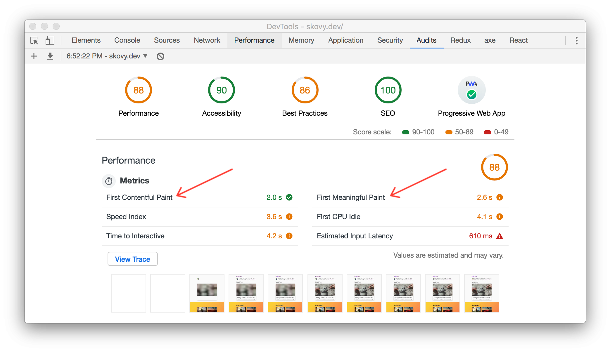
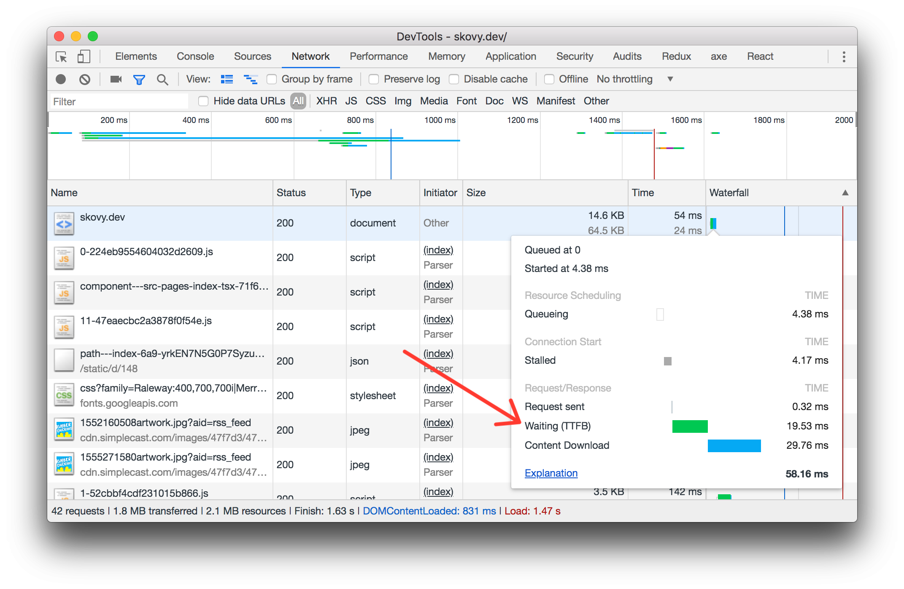
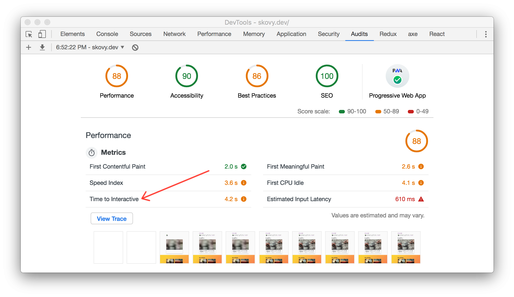
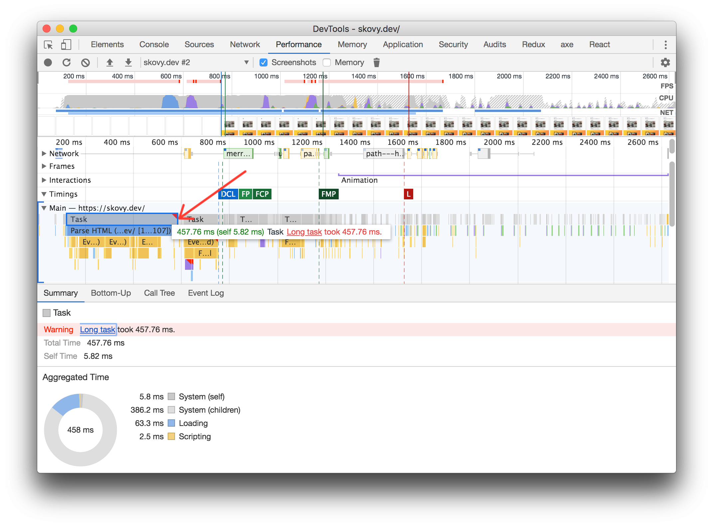

Up until a few months ago, I had no idea how to think about frontend
performance, what it means, or how to measure it. Previously, I've looked at server
response times and often assumed if that was "fast" the whole user experience
would be "fast." However, there's a lot more to the performance of an application
and the overall user experience. This is an overview of what I learned after a
few months of trying to understand and implement frontend performance metrics.

### What is frontend performance?

My simplest definition is **"the time it takes for an application to become
usable."** For me, this is challenging to wrap my head around because "usable"
can be interpreted in different ways by different people _(or maybe the same
person on different days)_.

You could argue, when looking at something like server response time there's
one definition for "is it usable?" The overall response time. Before the
server responds, it's 0% usable. The user hasn't received the response and they
can't do anything without that. Once the server has responded it's now 100%
usable for the user (or at least for the client to make it usable). With that,
improving the server response time will improve the time it takes the server to
"become usable."

When looking at frontend performance it becomes less straightforward. Rarely, it's
exactly 0% or 100% usable, but rather somewhere between during an application's
life cycle. There are a large number of variables
that can affect the usability: the actual feature code efficiency (eg:
[maybe using `concat` vs `push` in a large loop](https://dev.to/uilicious/javascript-array-push-is-945x-faster-than-array-concat-1oki)),
network latency, server response time, server response size, JavaScript and CSS
file size, browser, available resources on the client, caching,
long running tasks, loading states, etc.

### Why care about frontend performance?

In general, better performance means a better user experience.

Unfortunately, we usually can't stop here and need to go a step further to
prove that it's a worthwhile business investment. Fortunately, a better
experience will usually lead to an increase in some important business metric.

This may mean users will spend more time using your product (if you care about
that) or maybe it means they actually spend _less_ time using your product
because they can achieve their task quickly. Later on they might recommend it to
their friend since it was a fast and delightful experience.

It's hard to generalize what exactly improving performance will lead to, but
it will generally lead to an improvement of some important metric.

If you're looking for something more concrete, there are
[several great examples curated by Google Web Fundamentals](https://developers.google.com/web/fundamentals/performance/why-performance-matters/#performance_is_about_improving_conversions)
outlining specific cases of how performance directly improved important metrics.

_([Google Web Fundamentals](https://developers.google.com/web/fundamentals/)
was an invaluable resource when investigating and learning about frontend
performance. Much of this content was inspired from their resources)_

## What should be measured?

Even though frontend performance may not be an exact science, we need something
precise to measure. Given the qualitative feedback that "the application
feels slow" how do you know it's slow and not a networking issue? Or, some other
factor? You don't. We need to measure something, but what?

Reframed in the context of the above definition: **what measurements can be made
that would determine if an application is usable?** The [Web Fundamentals](https://developers.google.com/web/fundamentals/performance/user-centric-performance-metrics)
does an excellent job outlining questions that can be related to exact numbers:
_Is it happening? Is it usable? Is it delightful?_

### Is it happening?

How does the user know if anything is happening when first navigating to your
application? Something visually different appears or "paints" on the screen.
There are actually three common "paint" measurements:

- [First Paint (FP)](https://developer.mozilla.org/en-US/docs/Glossary/First_paint):
  _the time it takes to render the first pixels on the screen, something visually
  different from the previous page_
- [First Contentful Paint (FCP)](https://developer.mozilla.org/en-US/docs/Glossary/First_contentful_paint):
  _the time it takes to render the first element or piece of content_
- [First Meaningful Paint (FMP)](https://developer.mozilla.org/en-US/docs/Glossary/first_meaningful_paint):
  _the time it takes the most important content to load, often referred to as
  the hero content_



<span class="image-caption">
First Contentful Paint (FCP) and First Meaningful Paint (FMP) in Lighthouse
</span>

Another metric that can be helpful to provide a full perspective is the amount
of time it takes to start receiving a response from the server.

- [Time to First Byte (TTFB)](https://developer.mozilla.org/en-US/docs/Glossary/time_to_first_byte):
  _the time it takes from the start of the request to receiving the first byte_.

From the frontend perspective, this is where you can start to control the
performance experience. Before this point is the DNS lookup, request overhead,
server time, network latency, etc. (things generally out of the control of the frontend).
It's also straightforward to calculate using the
[`Performance​Navigation​Timing` API](https://developer.mozilla.org/en-US/docs/Web/API/PerformanceNavigationTiming).

The Time to First Byte timing is also visible in the Chrome Devtools under the Network
tab.



<span class="image-caption">
Time to First Byte (TTFB) in Chrome Devtools
</span>

### Is it usable?

The user is aware it's happening, they can see something visually on the screen.
Usually there are interactions like a button or link. Presumably, they'll
want to click or interact with the page in some way. But, can they?

- [Time to Interactive (TTI)](https://developer.mozilla.org/en-US/docs/Glossary/Time_to_interactive):
  _the time is takes for the application to render and be ready to handle user input_

This metric is more complicated and relies on a few criteria. First, the application
is rendered so by definition it's always after the First Paints. Second, it's
"ready" to handle user input.

What does "ready" mean? For Time to Interactivity, it's measured as the first
time the main thread _will be_ inactive for 5 seconds meaning that any user
input could be handled. It can be a bit tricky to understand since we have to
wait 5 seconds to see if that given point was followed by 5 seconds of inactivity.
Time to Interactive is not a standardized performance metric and requires using
the [Long Tasks API](https://developer.mozilla.org/en-US/docs/Web/API/Long_Tasks_API) _(see below for more details)_.



<span class="image-caption">
Time to Interactive (TTI) in Lighthouse
</span>

### Is it delightful?

I like to think about all of the previous metrics as snapshots along a timeline.
First Paint has to happen before First Contentful Paint. Both have to happen
before Time to Interactive. But what about the prolonged usage of the
application after the initial load? There are two more measurements that can
help answer this question:

- [Long Running Task](https://developer.mozilla.org/en-US/docs/Web/API/Long_Tasks_API):
  _a long running task is any task that takes longer than 50 milliseconds to complete_
- [First Input Delay](https://developer.mozilla.org/en-US/docs/Glossary/First_input_delay):
  _the time it takes from the user interacting (eg: clicking a button) to when the
  browser responds_

The Long Running Tasks are also used to calculate the Time to Interactive, but they can
also be measured on their own. Anytime there is a Long Running Task it could
potentially impact the user's experience. The threshold is 50 milliseconds
because anything above 100 milliseconds may feel delayed to a user.



<span class="image-caption">
Example of a Long Running Task in Chrome Devtools
</span>

The First Input Delay compliments the Time to Interactive measurement, but the
difference is that the First Input Delay actually requires a user to interact
with the page. Each measurement is an actual length of time that a user had
to wait for the browser to handle their interaction. First Input Delay can
happen at any point, not at a set point along the timeline like the earlier
metrics.

## How should it be measured?

In general, there are two approaches for measuring frontend performance: "lab
tools" and "real world tools."

You can think of lab tools as something run on a your computer (or on a small
sample) to get a general idea of how the application is performing. The numbers
are not a true representation since there can be a large amount of variability
depending on the device type, network connections, etc.

To collect a true representative sample the metrics need to be collected in the real
world, often referred to as Real User Monitoring (RUM). This approach uses
browser APIs to collect and report these metrics to a tool like Google Analytics
or maybe a custom integration with Datadog or another performance monitoring tool.

### Lighthouse

[Lighthouse](https://developers.google.com/web/tools/lighthouse/) is a tool
available in Chrome Devtools _(screenshots above)_ under the Audits tab. It's
also available as a node module to run in other environments like CI.

It provides insights into many of these performance metrics and a few more.
Lighthouse also includes other useful information around accessibility,
Search Engine Optimization (SEO), Progressive Web Apps (PWA) and concrete
approaches to improve the performance of your application.

Again, this is an excellent tool to get a general idea of the overall
performance or where the bottlenecks might be. However, if you want to
quantitatively discuss the performance of your application with precise numbers
you'll need to implement Real User Monitoring.

### Browser APIs & Polyfills

Real User Monitoring can be implemented using browser APIs (in "modern" browsers)
and polyfills available to measure the frontend performance of an application. There are
also several open source packages and paid solutions that take care of most of
these implementation details. As with most decisions, you'll have to decide if the
costs and benefits are worth using one of these tools or reaching for the browser
APIs. Regardless, it can be beneficial to have an idea of how these metrics are
being measured under the hood.

#### Measuring Time to First Byte (TTFB)

Measuring Time to First Byte is the easiest of these metrics to collect.

To start, most of these metrics rely on the [Performance API](https://developer.mozilla.org/en-US/docs/Web/API/Performance)
either directly or as part of the computation for a metric. To measure the time
it takes to receive the first byte of data from the server we need to know
the **difference between when the response started and when the request started**.

This data is part of the [Navigation Timing API](https://developer.mozilla.org/en-US/docs/Web/API/PerformanceNavigationTiming).
It can be retrieved by passing the [`entryType` of `navigation`](https://developer.mozilla.org/en-US/docs/Web/API/PerformanceEntry/entryType#Performance_entry_type_names)
to the [`getEntriesByType`](https://developer.mozilla.org/en-US/docs/Web/API/Performance/getEntriesByType)
function available on the performance object. To put this into code:

```typescript
// Get the performance entry for the browser navigation events
const pageNav = performance.getEntriesByType("navigation")[0];

// Calculate the time it took to receive the first byte
const durationMs = Math.round(pageNav.responseStart - pageNav.requestStart);

// Log or track the metric
console.log({ name: "time-to-first-byte", durationMs });
```

- `Math.round` is optional but can be nice to collect these metrics as whole
  milliseconds (rather than floats) to keep the data clean.
- `console.log` would be replaced with custom logic to collect and aggregate the performance data.
- If using TypeScript, it may be necessary to cast `pageNav` to `PerformanceNavigationTiming`.

#### Measuring First Paints (FP & FCP)

Fortunately, there is also a browser API for tracking First Paint and First Contentful
Paint but it's slightly more involved. The same approach as above can be used but passing
the [`entryType` of `paint`](https://developer.mozilla.org/en-US/docs/Web/API/PerformanceEntry/entryType#Performance_entry_type_names)
to `getEntriesByType`.

```typescript
performance.getEntriesByType("paint");
```

However, if this is added in the `head` (or early) in the document, it may
return `[]` (an empty array) if invoked before the browser has painted so
the `first-paint` or `first-contentful-paint` entries will not exist.

This is where the
[`PerformanceObserver`](https://developer.mozilla.org/en-US/docs/Web/API/PerformanceObserver)
can be useful. It will observe performance events and can invoke a callback when
a specific event occurs. However, this can have the _opposite_ problem if the
observer is created after the paint events have occurred the callback will never
be invoked. This will no longer be a problem once the `PerformanceObserver`
accepts the [`buffered`](https://w3c.github.io/performance-timeline/#dom-performanceobserverinit-buffered)
parameter. Until then, ensure `PerformanceObserver` is initialized as early as
possible, such as in the head of the document.

```typescript
(() => {
  // Early return in browsers that don't support the paint
  // timing API. This assumes if the browser supports
  // the PerformancePaintTiming API it also supports the
  // PerformanceObserver API.
  if (!("PerformancePaintTiming" in window)) {
    return;
  }

  const observer = new PerformanceObserver(list => {
    for (const entry of list.getEntries()) {
      // The `PerformanceEntry` has a `startTime` and
      // `duration` attribute. Usually, these need to
      // be subtracted but `duration` is always `0` for
      // paint entries.
      const durationMs = Math.round(entry.startTime);

      // `entry.name` will be either `first-paint`
      // or `first-contentful-paint`. Log or track
      // `entry.name` and `durationMs`.
      console.log({ name: entry.name, durationMs });
    }
  });

  observer.observe({ entryTypes: ["paint"] });
})();
```

If looking to measure First Meaningful Paint
that will likely need to be a custom implementation since that depends on the
specific application and what is considered the most important content. Check
out the [Performance `mark` API](https://developer.mozilla.org/en-US/docs/Web/API/Performance/mark)
for one possible approach for the custom performance measurement.

#### Measuring Time to Interactive (TTI)

Unfortunately, there currently is not a browser API available for tracking Time
to Interactive. However, the [`tti-polyfill`](https://github.com/GoogleChromeLabs/tti-polyfill)
package works great for polyfilling this functionality.

First, install the package as a standard dependency (`npm install tti-polyfill`
or `yarn add tti-polyfill`). Second, add the snippet of code under the
[Usage docs](https://github.com/GoogleChromeLabs/tti-polyfill#usage)
to the head of the document.

This snippet observes long running tasks. It has to be added as early as possible
to work around the same issue mentioned above when measuring first paint. This
will no longer be a problem once the `PerformanceObserver` accepts the
[`buffered`](https://w3c.github.io/performance-timeline/#dom-performanceobserverinit-buffered)
parameter.

Now, the `getFirstConsistentlyInteractive` function can be invoked at any time
from the polyfill package. This function will return a promise that resolves to
the duration of time to reach interactive.

```typescript
import { getFirstConsistentlyInteractive } from "tti-polyfill";

getFirstConsistentlyInteractive().then(durationMs => {
  // Guard against `null` when no TTI value can be found,
  // or the browser doesn't support all the APIs required
  // to detect TTI.
  if (durationMs) {
    // Log or track the metric
    console.log({
      name: "time-to-interactive",
      durationMs: Math.round(durationMs)
    });
  }
});
```

If using TypeScript, the following type definitions can be used for the `tti-polyfill` package:

```typescript
declare module "tti-polyfill" {
  interface Options {
    minValue?: number | null;
    useMutationObserver?: boolean;
  }

  type GetFirstConsistentlyInteractive = (
    options?: Options
  ) => PromiseLike<number | null>;

  export const getFirstConsistentlyInteractive: GetFirstConsistentlyInteractive;
}
```

#### Measuring First Input Delay (FID)

First Input Delay is measured in a similar fashion to Time to Interactive.
It doesn't currently haven an official browser API but there is also a polyfill
available: [`first-input-delay`](https://github.com/GoogleChromeLabs/first-input-delay).

This polyfill can be installed as a package, but the recommend approach is to
[inline the snippet](https://github.com/GoogleChromeLabs/first-input-delay/blob/master/dist/first-input-delay.min.js)
in the head of the document to ensure the first input is always captured.

Now that the snippet is added, `perfMetrics.onFirstInputDelay` is exposed on
the `window`. `onFirstInputDelay` is invoked by passing a callback function that
will receive the duration for the First Input Delay.

```typescript
window.perfMetrics.onFirstInputDelay(durationMs => {
  // Log or track the metric
  console.log({
    name: "first-input-delay",
    durationMs: Math.round(durationMs)
  });
});
```

If using TypeScript, the following type definitions can be used with the `first-input-delay` snippet:

```typescript
type OnFirstInputDelay = (callback: (duration: number) => void) => void;

interface PerfMetrics {
  onFirstInputDelay: OnFirstInputDelay;
}

declare global {
  interface Window {
    perfMetrics: PerfMetrics;
  }
}
```

### Other considerations

There are a handful of other things that may be useful to consider when
measuring these frontend performance metrics. None of these are hard
requirements but questions that I had when investigating frontend performance
and will likely depend on your use case.

First, when should these metrics be collected? For example, are these only on
the first page load? If you have a single page app (SPA) should some of these
metrics like Time to Interactive be collected on page transitions? First page
load is usually the easiest but may not provide a holistic view.

Furthermore, what if the user navigates to your application but then visits another
tab? It may be worthwhile to consider ignoring metrics collected if
`document.hidden` was true at any point since this can impact the performance
metrics. An example snippet of code that could be used to check for this:

```typescript
let hidden = document.hidden;

// Track if the document was hidden at any point.
document.addEventListener("visibilitychange", () => {
  if (document.hidden) {
    hidden = true;
  }
});
```

Another consideration may be to introduce bounds to avoid collecting any unexpected
data. For example, all metrics must be greater than `0` and less than an
arbitrary upper bound, say `60000` (1 minute). Generally, these metrics should be
positive and hopefully significantly less than 1 minute so this shouldn't
be necessary.

Having these metrics are great, but as an entire aggregate it may be hard to
pinpoint exact problems. Therefore, it may be beneficial to also collect metadata
such as the device type _(eg: phone, tablet)_, browser, connection type _(eg: 2g, 4g)_,
the page or other metadata specific to your application to slice the metrics
_(see the [Chrome User Experience Report](https://developers.google.com/web/tools/chrome-user-experience-report/) for more inspiration)_.

Lastly, where should these metrics be collected? There are several examples of
collecting performance metrics in Google Analytics. This may be a good option
for smaller applications. However, when working on a larger team it may be
worthwhile considering tracking these metrics in the same place as other
performance metrics. For example, if all your performance monitoring is in [Datadog](https://www.datadoghq.com/)
it may be worth the effort to collect the data there to have all performance
monitoring, alerting, etc. collocated for easy access.

## Conclusion

This post covered some of the most common frontend performance metrics, what
they are and how to measure them:

- Time to First Byte (TTFB)
- First Paint (FP)
- First Contentful Paint (FCP)
- First Meaningful Paint (FMP)
- Time to Interactive (TTI)
- First Input Delay (FID)

Remember, these APIs are not available in all browsers so make sure to verify
they exist before using them to avoid issues in browsers that do not yet support
these APIs.

Interested in learning more? Listen to this
[episode on Rubber Ducking about frontend performance](https://rubberducking.fm/15),
read [Google Web Fundamentals](https://developers.google.com/web/fundamentals/),
or reach out on [Twitter](https://twitter.com/spencerskovy).
