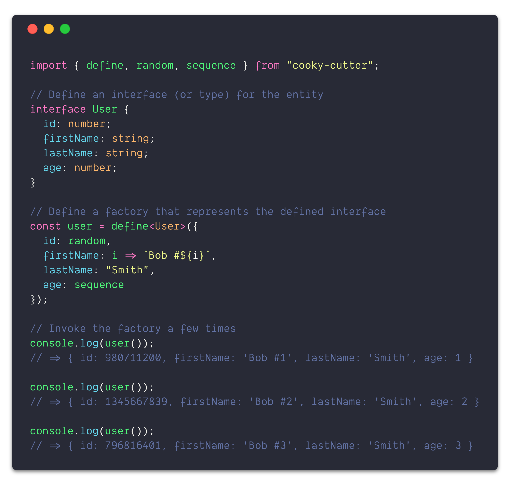
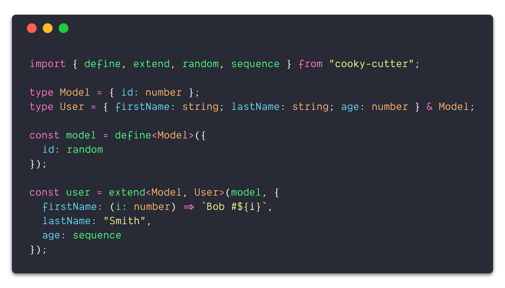

When writing frontend tests I always find factories useful for stubbing the data layer. At the simplest level, a factory is responsible for “manufacturing” data — hence the term. Similar to a real-world physical factory, it’s responsible for repeatedly outputting a “unit” following a specification, in this case, an object. For example, a JavaScript factory for a basic user entity with only a name and age property may look something like the following.

```typescript
const user = () => ({ name: "Jill", age: 42 });
```

Every time this user factory is invoked, a new object with a name and age property will be returned. This works great! …until we want to override a property, or the user model grows to dozens of properties, or the age needs to be randomized, etc. At a certain point, an abstraction or package is necessary to wrangle all of the necessary functionality for larger projects as the factory complexity and customization needs grow.

## Why _another_ factory package?

There are many factory packages available in many languages like [`factory_bot`](https://github.com/thoughtbot/factory_bot) for Ruby and dozens of others for JavaScript. However, when looking for factory packages written in TypeScript (or even JavaScript with external type definitions) there are not many options. Additionally, many of them require a lot of boilerplate just to set up a basic factory.

These personal pains directly translated to the two goals in mind when setting out to create _yet another_ factory package in the ecosystem.

- First, it has to have **first-class types**. I personally don’t like dealing with (or maintaining) external type definitions. Additionally, if the package is not designed with type safety in mind, it can be difficult defining truly safe types as an afterthought. Things like casting should not be needed and all usages should be type safe to avoid easily catchable problems within a type system, like typos, missing properties, invalid properties or type mismatches.

- Secondly, it should be **easy to use and setup** like the user function above. It should not be necessary to open the docs every time to remember all of the “ceremony” around defining a simple factory.

With these two goals in mind, the result was the [`cooky-cutter`](https://www.npmjs.com/package/cooky-cutter) package! (_with an attempt at original naming, every variation of factory and cookie is already taken_ 😅). If you’ve faced similar pains before around type safety or overly verbose APIs when working with factories, give [`cooky-cutter`](https://www.npmjs.com/package/cooky-cutter) a try!

## Getting started 🍪

Assuming you already have a TypeScript project setup, install [`cooky-cutter`](https://www.npmjs.com/package/cooky-cutter) as a development package.

```
npm install --save-dev cooky-cutter
# or
yarn add --dev  cooky-cutter
```

After it’s installed, import the `define` method to define a new factory.



<span class="image-caption">
An example of defining a factory
</span>

Some other useful functions include `extend` for creating a new factory by extending an existing factory or the `sequence` and `random` helpers for factory attributes.



<span class="image-caption">
An example of extending an existing factory and using attribute helpers
</span>

See the [full documentation](https://skovy.github.io/cooky-cutter/) for the full API and common “recipes” (😉) or check out the [GitHub repository](https://github.com/skovy/cooky-cutter).

_Did you find this package useful or have some feedback? Let me know on [Twitter](https://twitter.com/spencerskovy)!_
