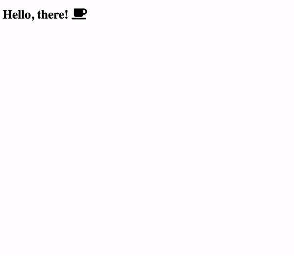

At some point nearly every app has a need for icons. [Font Awesome](https://fontawesome.com/)
is one of many options that can fit this need. When first adding Font Awesome
to a server side rendered application 
[it's](https://github.com/FortAwesome/react-fontawesome/issues/53) 
[common](https://github.com/FortAwesome/vue-fontawesome/issues/14) 
[to](https://github.com/FortAwesome/react-fontawesome/issues/27) 
notice the icons "flickering" large for a split second.


<span class="image-caption">
Example of refreshing a server side rendered React app with a Font Awesome icon.
</span>

## Why is this happening?

For Font Awesome to work properly, the supporting CSS must exist. This is
accomplished by the Font Awesome
[SVG core package](https://www.npmjs.com/package/@fortawesome/fontawesome-svg-core).
It dynamically inserts CSS into the head of the HTML document when it's called.
For example, when an icon is used it will
[ensure the CSS](https://github.com/FortAwesome/Font-Awesome/blob/090e6148d3f63a45b40e7cd8679bd4d64e58d75d/js-packages/%40fortawesome/fontawesome-svg-core/index.js#L2131-L2137)
has been added.

This works great for a client rendered app because the CSS gets added right
before the first icon is rendered. However, with a server side rendered app,
the icon already exists in the HTML before the JavaScript bundle has even loaded,
let alone before it has been invoked and able to insert the CSS.

The time it takes between the initial HTML rendering and the SVG core package
inserts the CSS is the cause of the "flicker." This would likely be more
exaggerated on slower networks since the time between the HTML rendering and
the script downloading is likely longer.

## How is this fixed?

It requires a little bit of additional work but fortunately Font Awesome provides
all of the necessary APIs to server render icons and avoid the "flicker" caused
by the dynamic injection of CSS. To solve this problem, the gap between the
icons rendering and the CSS being added needs to be removed. But how?

The initial render on the server needs to respond with this CSS already inlined.
This can be done using the [`dom.css()`](https://fontawesome.com/how-to-use/with-the-api/methods/dom-css)
method. The following is an example of an `HTML` component that will
be rendered using [`renderToStaticMarkup`](https://reactjs.org/docs/react-dom-server.html#rendertostaticmarkup).

```tsx
// server-side rendered component
import { dom } from "@fortawesome/fontawesome-svg-core";

const HTML = () => (
  <html>
    <head>
      // other links, styles,etc.
      <style type="text/css">{dom.css()}</style>
    </head>
    <body>{/* server rendered content */}</body>
  </html>
);
```

In the initial HTML response the style tag with the Font Awesome specific styles
should now be visible.

```html
<!DOCTYPE html>
<html>
  <head>
    <style type="text/css">
      svg:not(:root).svg-inline--fa {
        overflow: visible;
      }
      /* And a bunch more styles... */
    </style>
  </head>
  <body>
    /* server rendered content */
  </body>
</html>
```

However, if you inspect the DOM after the client has loaded, there are  
_two duplicate_ `style` tags with the same Font Awesome styles.

```html
<!DOCTYPE html>
<html>
  <head>
    <style type="text/css">
      svg:not(:root).svg-inline--fa {
        overflow: visible;
      }
      /* And a bunch more styles... */
    </style>
    <style type="text/css">
      svg:not(:root).svg-inline--fa {
        overflow: visible;
      }
      /* And a bunch more styles... */
    </style>
  </head>
  <body>
    <!-- server rendered content -->
  </body>
</html>
```

Why is this happening? The styles are manually added on the server. This
fixes the large "flickering" since the CSS is immediately available, However, the
client is also still injecting the styles once it has loaded. There is also the
[`autoAddCss`](https://fontawesome.com/how-to-use/with-the-api/setup/configuration)
configuration option available to disable this.

```tsx
// client entry point file
import React from "react";
import ReactDOM from "react-dom";
import { config } from "@fortawesome/fontawesome-svg-core";

import App from "../shared/app";

// Disable the automatic insertion 
// of CSS into the head of the document.
config.autoAddCss = false;

const root = document.getElementById("root");
ReactDOM.hydrate(<App />, root);
```

An animated GIF would be included like above but it would appear to be a still
screenshot now that the flicker is fixed.

## Conclusion

Now, the required Font Awesome styles are immediately available because the
initial server response inlines them in the `head` of the document. Additionally,
the duplicate addition of styles is fixed by disabling that behavior on the client.

As with most packages, server side rendering introduced additional overhead and
complexity but it's a tradeoff for other benefits such as a potential for more
performant first paints or improved SEO.

> The full code for a simple server side rendering React app with Font Awesome
> [is available here](https://github.com/skovy/react-server-side-rendering).
