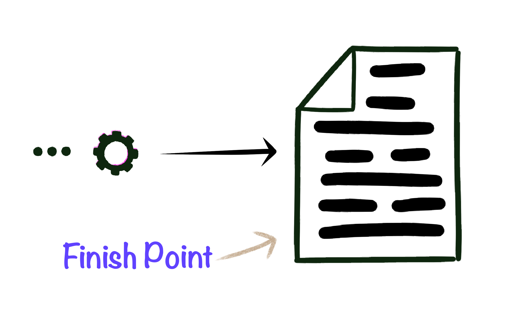
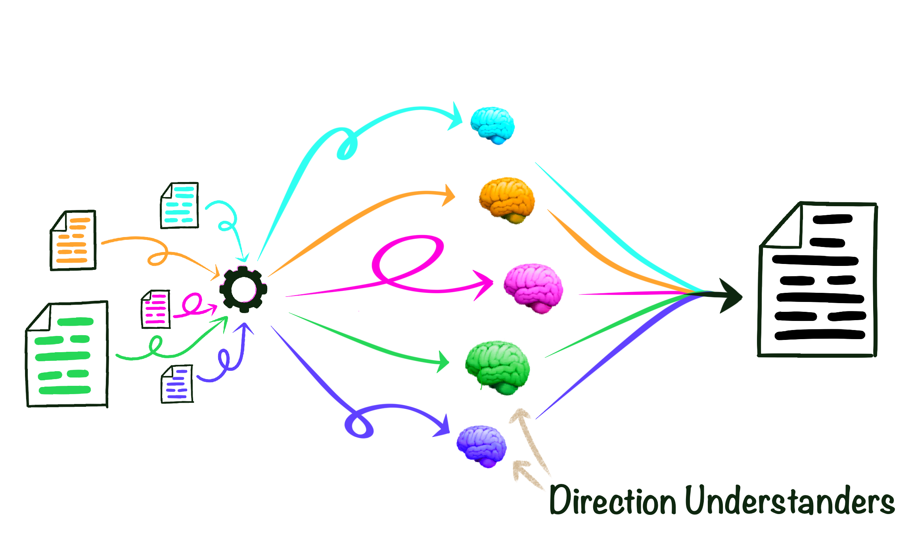
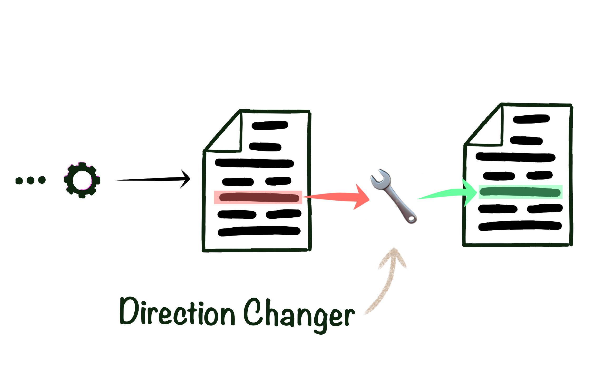

_(Written using only the ten hundred words people use the most often, as stated
by [the computer place with funny black and white drawings](https://xkcd.com/simplewriter).
This post was originally published as part of 
[JavaScript January](https://www.javascriptjanuary.com/blog/the-hard-thing-about-simple-words))_

Today, there are a lot of big words used to explain things that could be
understood by a larger group of people if instead simpler words were used.

When I write I often fall into this situation myself. It's easier to use a
single big hairy word rather than several smaller, but easier to understand
words. These and the following words try to explain something using only the
ten hundred most often used words.

Every day, hundreds of hundreds of people visit pages on computers all around
the world. These people want these pages to work quickly. This usually means
saving as few things as possible when they visit a page. However, if you are the 
person that writes the directions that computers use to make these pages, that's 
probably not how you want to write those directions.

When writing and working on those computer directions, you probably would
rather have many small groupings of directions. This way it's easier to keep
everything in your head when working on it. If every single direction was in one
grouping, it would be very hard to keep it all in your head. If other people are
also making changes at the same time it can be hard to put those together if
it's all in one spot. By having many different direction groupings, it easier to 
keep all the things you're working on in your head and another person is
probably not also making changes in the same spot.

For a computer place with many pages, it might be written with hundreds and
hundreds of groups of direction. But if a person on the other side of the world
wants to visit this page, it would take a long time to save all of these
different groupings.

The people who write these direction want to work with many small groupings,
but the people that view these pages want to save only a few large groupings. So 
how do we get from hundreds and hundreds of direction groupings into only one 
big grouping of directions?

**The thing that puts different groupings of directions into a single grouping 
of directions.** For short, we'll call it the 
[Direction Grouper](https://webpack.js.org).

How does it work?

## Starting Point

To start, the thing itself needs a place to start.
That's the [starting point](https://webpack.js.org/concepts/entry-points/).

It's possible to have more than one starting point but that's usually not needed.
The Direction Grouper begins at the starting point and finds all of the other 
direction groupings that the starting point needs. Then it finds the direction
groupings that those direction groups need and so on and so on.

As the Direction Grouper jumps around it can then build a huge map of which 
direction groupings need which direction groupings. This can be any number of 
layers deep and by the finish point, it may have found hundreds of hundreds of 
direction groupings.

## Finish Point

Once the Direction Grouper finishes building a huge map of all the direction
groupings it can then use the map to put all the different groupings into a 
single big grouping.

When it's done figuring this out, it then saves this
[finishing point](https://webpack.js.org/concepts/output/) and this is
what people all around the world will then save on their computer when they visit.

To quickly go over, it starts with one direction grouping, finds all the other 
direction groupings, figures out how to put those all together, and ends with a 
single huge grouping.

However, it's doing a lot of other things between the starting point and
finish point.

## Direction Understanders

As the Direction Grouper jumps around between direction groupings, it might find 
different kinds of direction groupings. There can be any number of different 
kinds of direction groupings, but there are a few that show up often:

- Directions that run on the person's computer.
- Directions that make things look pretty.
- Directions that show pictures.
- Directions that change the way the words appear when reading.

These are only a few, but there are many more kinds. How is the Direction Grouper
supposed to understand so many different things?

The short answer: it doesn't! Instead, it uses
[Direction Understanders](https://webpack.js.org/concepts/loaders/). 

Each different kind of direction grouping has a special Direction Understander 
that knows how to understand only that kind of direction grouping. When using 
the Direction Grouper, you can add as many Direction Understanders as you want!

If you need to make things look pretty, then a Pretty Direction Understander is 
added. If you need to show pictures, then a Picture Direction Understander is added.

## Direction Changers

Once the directions are understood, you sometimes want to change, add or remove directions.

[Direction Changers](https://webpack.js.org/concepts/plugins/) can be used to 
change one direction for another, remove extra directions and make them smaller, 
move directions to another spot, or any number of other things.

## Work Size

There are different [work sizes](https://webpack.js.org/configuration/mode/) you
can use to control how much work the Direction Grouper, Understander, and Changers do.

Changing the directions a lot usually takes a lot more time to run, but it usually
means fewer directions for the person on the other side of the world to save so 
it's faster for them. Changing the directions less means it runs faster but 
takes longer for the person to save.

This means when you're working on the direction and making a lot of changes, you
want to make fewer changes to the directions. It will run faster for you to make a
lot of changes quickly.

Then, when you are ready to share it with the world, you make a lot of direction
changes. You only have to do this once in a while and means the hundreds and
hundreds of people that need to save the direction grouping will be able to do so
quickly.

## Final Thoughts

There are many single words that could have been used to remove whole parts of
this. The next time you're trying to explain something, consider if you may be
ignoring a whole group of people that may be interested in what you're writing
about by using a "big" word where a few of the most used words might do as well.
It doesn't need to be taken this far but it can make you stop and think if you
really understand the thing instead of repeating words.

Do you have other ideas for things that you would like to see explained?
[Let me know](https://twitter.com/spencerskovy) on the computer place with two
hundred and eight tens of letters.
