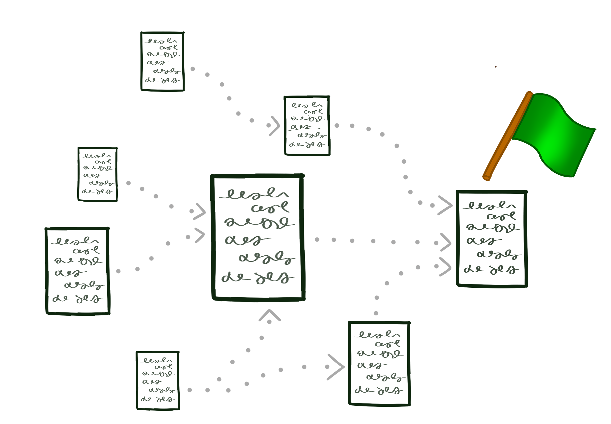

_(Written using only the ten hundred words people use the most often, as stated by the funny black and white drawings computer place)_

Today, there are a lot of big words used to explain things that could use simpler words that could be understood by a larger group of people. When I write I often fall into this situation myself. It's often easier to use the single big hairy word rather than several smaller but easier to understand words. These and the following words are a try to explain something I find hard to understand using only the ten hundred most often used words.

If you are a person that puts words into a computer all day that then runs on a computer that any person around the world can see on another computer you probably use this thing every day. Often, you write a small group of words in one spot that needs another small group of words in a different spot. In a big company, this might be hundreds of hundreds of different small groups of words. It's often takes too long for the person on the other side of the world to save onto their computer. They usually only want to save a single grouping of words (or a few small groups, not hundreds and hundreds) because it's faster. But you don't want to write only a few groupings of words because those groupings of words may get hundreds of hundreds of lines long. That's way too long for any one person to hold in their head.

So how do we get from hundreds and hundreds of word groupings into only a few groupings of words? The thing that puts different groupings of words into a single grouping of words.

But this sounds really hard to do. How does it work?

## Starting Line

Well, to start, it needs a place to start. That's the starting line.

It's possible to have more than one starting line but that's usually not needed. This starting line is where everything starts. The Thing finds all of the other word groupings it needs, then the word groupings those word groups need and so on. The "thing" can then build a huge map of what word grouping needs which word groupings. This can be any number of layers deep and by the finish line, it may have found hundreds of hundreds of word groupings.

## Finish Line

Once a huge map has been built between all of the word groupings it can then figure out which order they need to be put together and used. At the end, it saves this ending point and this is what people all over the world can save on their computer.

So it starts with one word grouping, finds all the other word groupings, and then ends with a single huge grouping of words? A lot of other things happen between the start and end though.

## Word Understand-ers

There are many different kinds of word groupings. Some words run after a person has saved them, some make the thing they are looking at pretty, some show pictures, show change the way the words appear, or any number of other things. How is this thing supposed to understand so many different things?

It has word understand-ers that can only understand one kind of word grouping. But the thing can have as many word understand-ers as you would like. If you only need to run the words, you only need the word understand-er for that. If you want to make things look pretty then you add the word understand-er for that. If you want to change how the words look then you change the thing understand-er for that.

## Word Change-ers

After understanding the words, you often want to change the words. Word Change-ers can be used to change one word for another, make the words smaller, remove extra words or completely change from one set of word to another. 

## Word Size Change-er

There are two different "sizes" you can use to control how much the words are changed. Changing the words a lot usually takes a lot more time to run, but it usually means less words for the person on the other side of the world to save so it's faster for them. Changing the words less means it runs faster but takes longer for the person to save. This means when you're making a lot of changes, you want to make less changes to the words. This means it's faster for you to make a lot of changes quickly. Then, when you are ready to share it with the world, you make a lot of word changes because you only have to do this once in a while and means the hundreds and hundreds of people that need to save the word grouping will be able to do so quickly.

