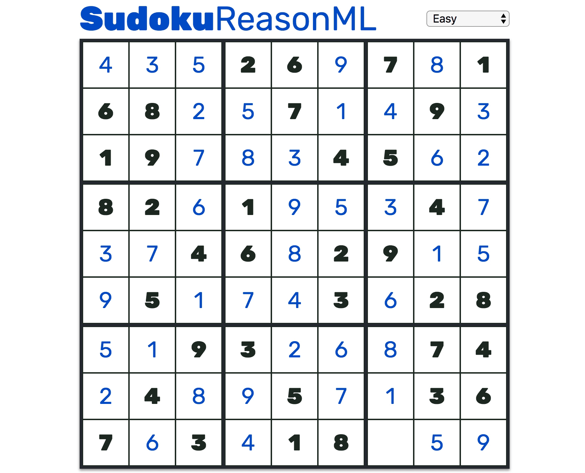
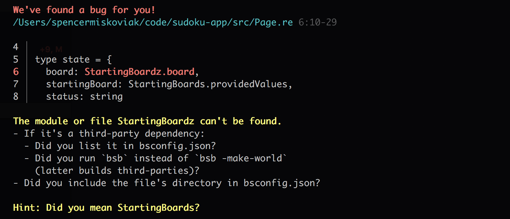

I set out to build a basic sudoku board. It’s straightforward but has enough complexity that would require learning a spectrum of Reason and ReasonReact features such as components, state management, styling, and basics of data structures for preloaded state for various boards and validation. The [full source is on GitHub](https://github.com/Skovy/sudoku-reasonml), and [a demo of the sudoku board is here](https://skovy.github.io/sudoku-reasonml/).

Demo of the Sudoku board.

## Initial thoughts

While making a simple sudoku board, there were some delightful surprises, a few helpful tools, and a rough edge or two. After making a single, simple app, these are some of my thoughts working with Reason.

### 😍 Types

When I first started programming, I recall often being annoyed with types. They’re just one more thing to type (don’t worry, “punning” is next) and add additional constraints.

After being burned a few times and working with TypeScript for over a year, it’s safe to say I’m now on the other end of the spectrum. I’m a big fan of TypeScript and the static typing. However, it’s more of a middle ground and always provides the `any` escape hatch. Reason has 100% type coverage, guaranteed soundness and still supports type inference similar to TypeScript. By the time I got to refreshing the browser, it almost always worked.

### 🏃‍ Punning

This was on the list of delightful surprises working with Reason. “[Punning](https://reasonml.github.io/docs/en/jsx.html#punning)” is shorthand syntax when a label and a value are the same. This is commonly used with object shorthand in JavaScript, instead of doing `return { name: name }`, you can do `return { name }`.

When passing props to a component in React, I typically catch myself doing something like `&lt;Component text={text} /&gt;`. However, with Reason JSX punning, it becomes `&lt;Component text /&gt;`. This is convenient when passing around props, and makes prop drilling slightly less painful. Thanks to the documentation, I also learned this pattern was called “punning.”

### ⚠️ Error messages

The error messages generally point you in the right direction, but leaves a little to be desired. It took some time getting used to parsing the messages coming from TypeScript (which I consider to have relatively good error messages). Occasionally the error output didn’t provide any information besides a generic error message or the messages would highlight the wrong lines.

Example error message for a missing semicolon

However, a few times I was also delighted by how *good* the error messages were. There are a few specific errors that the compiler offers suggestions on how to resolve the issue. This was really useful the first few times hitting those errors, although the suggestions were occasionally not close to the actual problem.

Example error message with suggestions

### ♻️ Stateful components

ReasonReact has full support for stateful React components, but it goes a step further and introduces a [built-in reducer](https://reasonml.github.io/reason-react/docs/en/state-actions-reducer.html). It’s similar to [Redux](https://redux.js.org/), and felt natural coming from the React and Redux world. At first, it seemed verbose and like unnecessary complexity on top of React’s `setState`. After using it for a while, it actually made the components a lot cleaner and easier to read in my opinion. First, every possible state change is defined as a [variant](https://reasonml.github.io/docs/en/variant.html), so it’s easy to see at a glance all the possible actions to change the state. Then, all of the actual logic for changing the state is consolidated in one place, rather than several disparate private helper methods.

### 💻 Testing

I wanted to minimally write a few unit tests for the validation logic of the sudoku board (*the red/green state in the demo above*). There is a [`bs-jest`](https://github.com/glennsl/bs-jest) Bucklescript wrapper for Jest, which gets the job done but otherwise there isn’t a great testing story for Reason. Moreover, as a whole [Reason bindings](https://redex.github.io/) for other libraries are limited.

### 💅 Refmt

Similar to [Prettier](https://prettier.io/) for JavaScript, Reason has `refmt` for reformatting code consistently across all projects. It worked great to understand what syntax was optional, see different ways to do similar things, and learn the community standard formatting. However, it’s not perfect and I ran into [an issue](https://github.com/facebook/reason/issues/1895) where the formatter output invalid syntax.

### 🔥 Build time

Blazing fast. By the time I switched to my terminal, the build was always finished. Granted this was a very small project, but the build time was near instantaneous. In the TypeScript world, I’m generally used to waiting a few seconds for a build to complete.
> “You can try slowing it down by adding a dozen layers of indirections and metaprogramming.” — [Documentation](https://reasonml.github.io/docs/en/faq.html#why-are-bucklescript-and-bsb-so-fast-how-can-i-slow-it-down)

### 👨‍👩‍👧‍👦 Community

Most of the official documentation for Reason and ReasonReact was very helpful. However, it was a bit terse at times for a newcomer to the community like myself. I never looked at OCaml (the language Reason is built on) previously but it felt at times it was expected for me have at least some experience.

Outside the official documentation, there are limited resources (Stack Overflow, GitHub, blog posts, etc). Although lurking in the official Discord chat everyone seemed more than willing to help and offer suggestions. The limitations are likely inherent because of the young community and an unfair comparison to the React community with an overabundance of resources. The biggest struggle for me was the lack of examples and understanding how the Reason, BuckleScript and OCaml ecosystems interact.

## Conclusion

The advantages of Reason — like type safety and fast build times — are delightful. There are some rough edges, but I think most of that is due to the project’s youth and will only get better with time. Overall, I’m excited to continue exploring Reason, dig into other features and watch the future improvements.