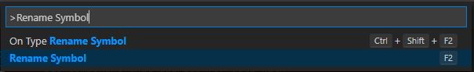

Design systems are often discussed and treated as if they are a static thing. However, a
"healthy" design system will likely be constantly evolving. This could be the result
of new data such as user research, new learnings about component APIs,
new ideas discovered in the community, a new use case, or changing requirements.

## Problems

Although this evolution is likely beneficial and results in a better system, it
can sometimes be challenging to make these changes.

### Renamings

The first general problem is needing to rename components, props, or something
else in the system that is exposed. 

For example, maybe after using a component for a while you realize there is a 
better, more meaningful name. This initially can seem like a simple change until
you realize it's used across hundreds of files in a number of different ways. 
Let's say there is a component named `Box` that needs to be renamed to `Card`. 
This requires updating imports and usages. 

We could try doing a global search and replace on a string with a single import.

```ts
import { Box } from "design-system";
```

What about cases with multiple imports?

```ts
import { Avatar, Box, Button } from "design-system";
```

We might consider a more sophisticated global search and replace with regex. 
What about cases where there are many components imported and the imports are 
each on a newline?

```ts
import { 
  Avatar, 
  Box, 
  Button,
  // ...
} from "design-system";
```

What seemed like a simple rename now has all sorts and we _only covered the 
imports_, not the actual usages. For example, a global search and replace for 
`<Box` (opening JSX) would also match something like `<BoxContainer` which shouldn't be renamed.

You can imagine similar problems when renaming props, especially ones with
common names such as `type`. How would you begin searching for the `type` prop 
on only one specific component?

### Evolving patterns

A related but different problem is when a new component or use case is added
and supported by the system.

Often, the existing patterns can't be updated mechanically as in the previous
example. Instead, they need to be updated manually. Often, this migration is too
much work to do all at once so it needs to be migrated over time. However, it can 
be easy to forget when working on some feature to also update the legacy pattern
to instead use the new component or prop. How can we encourage these patterns to 
be updated over time?

## Tools

There are a set of tools that can be helpful in making these type of system-wide
changes with ease and accuracy. Without these tools, these types of changes
can become a big headache, or the change being skipped entirely. 

### TypeScript

The first tool is TypeScript. This one can be tricky, because to really benefit
from it the whole codebase needs to be TypeScript. 

If that's the case, you can select the component or prop you want to rename use the 
[**"Rename Symbol"** option in VSCode](https://code.visualstudio.com/docs/editor/refactoring#_rename-symbol). This renames all usages across files.



This is only one of the many benefits of TypeScript. However, it's not feasible
for everyone to either switch to TypeScript, or quickly migrate the entire 
codebase. Fortunately, there's another tool that can be used.

### jscodeshift

Codemods are like a supercharged search and replace because they provide a lot
more context. A generic search is only matching on a string. However, codemods
operate on the actual AST (abstract syntax tree) that underlies the source code.
This means that you can much more accurately operate on a specific type of node, 
rather than any string that matches.

[jscodeshift](https://github.com/facebook/jscodeshift) is a specific tool for 
running these codemods on JavaScript and TypeScript. I've written about 
[creating a custom transform for jscodeshift](/jscodeshift-custom-transform/)
if you'd like to see a more in depth example.

### ESLint

The two previous tools are primarily used for renaming things or other mechanical
changes. Linting is a useful tool when it is easy to tell what needs to be updated,
but maybe hard to mechanically do the update.

For example, say when first building out a system you want to convert elements
with certain class names to the corresponding component.

```tsx
// Old element that needs to be converted:
<div className="card" />

// Converted to component:
<Card />
```

This example is fairly trivial and could likely be done with a codemod, but
you can imagine a case where it's maybe a group of related elements that are
now replaced by a single component. Or, maybe the existing usage had custom
styles that need to be resolved when making the update.

A custom linting rule could be made that looks for any `className` prop with a 
`card` class name. This rule could be set to warn, so as pieces of code are touched
the warnings will be surfaced and fixed. This can be more effective than written
or verbal communication because that can easily forgotten, whereas an inline
warning is much more contextual. It also provides a running list of
how many places still need to be migrated. Once all violations have been fixed,
the rule can be set to error to prevent regressions to previous patterns, or
entirely removed.

However, you want to be careful of "linting fatigue." Adding too many rules,
triggering false positives or negatives, or being too intrusive can be 
detrimental. 

## Conclusion

When evolving a design system there are a number of changes that seem simple,
but can be challenging due to both the number of uses and the number of unique
ways of using it. Hopefully the next time you need to make a system-wide change
that faces one of these problems, you're better equipped to know which tools are 
at your disposal.