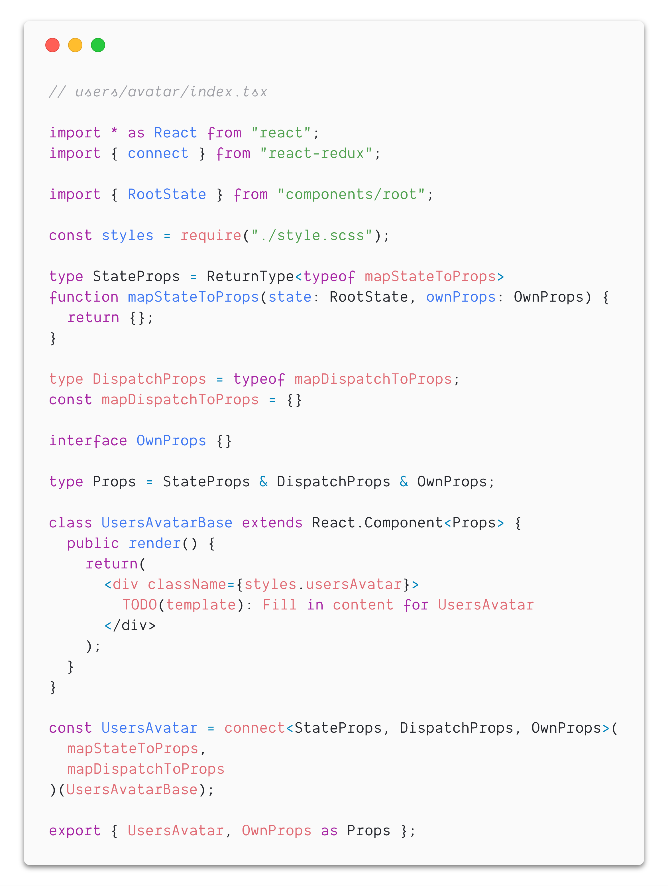
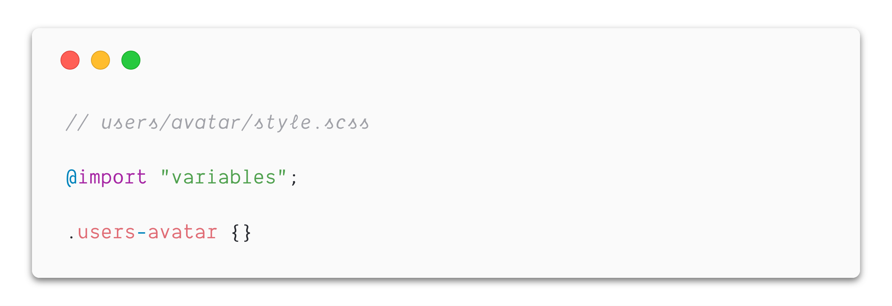

When working with React, components can be written in a number of ways as [functional](https://reactjs.org/docs/components-and-props.html#functional-and-class-components), [class](https://reactjs.org/docs/components-and-props.html#functional-and-class-components) or [pure](https://reactjs.org/docs/react-api.html#reactpurecomponent) components. In the majority of use cases, they can be used interchangeably. Sprinkle in Redux and decide which file(s) the [presentational and container](https://redux.js.org/basics/usagewithreact#presentational-and-container-components) components live along with the mapping functions. Consider adding TypeScript and choosing between a type or interface. What about file structure, naming conventions and _maybe_ a few more libraries? The result is a growing set of permutations that ultimately produces the same output.

Engineers building new components have to make the same set of decisions repeatedly. Reducing the burden of making those decisions would save time and energy for the important pieces, like building a great interface. Code generators are a great way to automate this. It saves both time and energy, ensures consistency across components, serves as a single source of truth documentation for both new and existing engineers, as well as reduces the necessary communication to get everyone _immediately_ up to speed on the current conventions.

## 📦 What are code generators?

There are several ways code can be generated. Most of my experience with generators has been in the context of a Rails app which supports [custom generators](https://guides.rubyonrails.org/generators.html).

### How do our Rails generators work?

For example, to create a `UsersAvatar` component from scratch, the custom generator would be invoked with the only argument being the path of the component: `rails generate react_component users/avatar`. With this information, the generator can determine where the component should live and the component’s name.

The generator then prompts: does the component need a stylesheet ([using CSS Modules](/writing-maintainable-styles-and-components-with-css-modules)) or does it need to be connected to the Redux store? Both default to “yes” to provide as little friction as possible and minimize necessary decisions upfront for engineers, it’s always easier to remove it later if not necessary.

This will output three files:

- `users/avatar/index.tsx`: the component implementation _(example below)_

- `users/avatar/style.scss`: the custom styles _(example below)_

- `users/avatar/spec/index.spec.tsx`: the component tests

Don’t copy and paste, code generate!

These two examples have worked well for us. Our generators aren’t strictly React community* “*best practices”, but instead what works best for the team. Although, many of the conventions are heavily inspired by the community.

As with any generalization, there are always exceptions. For example, maybe there’s a component with a rendering performance issue where `PureComponent` makes a measurable impact and it should be used.

> Generators aren’t rules, but rather guidelines that should be followed unless there’s a reason to deviate from the norm.

### Evolution

These generators are constantly evolving and allow us to easily share these updates with the team without having a team-wide meeting for every small change.

For example, when TypeScript [added support](https://www.typescriptlang.org/docs/handbook/release-notes/typescript-2-8.html#predefined-conditional-types) for `ReturnType` we immediately switched to this since everything in `mapStateToProps` is already typed, we were essentially “double typing” by implementing a `StateProps` interface as well as the `mapStateToProps` function.

Another example is when we learned that `mapDispatchToProps` [can be a plain object](https://github.com/reduxjs/react-redux/blob/master/docs/api.md#arguments) (instead of a function invoking `bindActionCreators`) we updated the generator to prefer the simplified syntax.

### Alternative Generators

There are several other tools like [Hygen](http://www.hygen.io/), but the specific tool is not the important part. Use the tool that works best and focus on the conventions and best practices that are encoded in the generators.

## 🤖 But, why use code generators?

Initially, I imagined generators would follow a similar lifecycle to written documentation. It would start out being 100% accurate, and as time went on it would become outdated as changes or additions were made in the codebase. However, unlike documentation, generators are part of the core development process.

> There is motivation to keep generators updated and accurate since they are used frequently and save time and energy for both the code author and code reviewer.

### 🏃‍ Speed and Reduced Decision Making

One of the best parts of generators is the time *and *energy it saves. Time isn’t wasted copy and pasting an existing component and rewriting it, or typing out everything by hand. Additionally, it saves energy deciding if this should be a functional or class component, remembering naming conventions, file structure, prop type definitions, etc.

### ♻️ Consistency

It saves additional mental overhead anytime an engineer comes back to a file to make a change, fix a bug or anything else in the future. They don’t have to spend the time or energy understanding the nuances of how *this component *was written since the foundation is identical to every other component, they can immediately focus on the unique logic, styling and other important specifics.

### ✅ Source of Truth

Similar to written documentation, generators start out as the single source. However, generators *remain *the single source of truth. If at any time someone believes there is a better way of doing something, they can open a pull request on the generator itself and start a discussion. This isolates discussion around conventions and best practices to the generators and avoids the need to leave small, nitpicky comments around conventions and best practices on pull requests for feature development.

Generators are particularly helpful when adopting new technologies as a team. The team can quickly iterate on the “best practices” or “conventions” that work best for them as new techniques are learned and discovered. Which leads into the next point; bringing everyone along.

### 👂 Ease of Communication

Each time a change is made to conventions *everyone *needs to have the full context and agree from that point on to follow that new standard or convention, remember to do so and rely on others to enforce in code reviews. What if somebody is off that day? What if somebody forgets? What if somebody copy and pastes an existing component?

With a generator, only a handful of people with the context need to agree and make the update to the generator. It’s still important to communicate these changes, but it’s significantly less critical since everyone is already using the generator, they’ll always be using the current, correct conventions.

This is particularly beneficial for new engineers joining a team. They don’t need to ask others or read the extensive documentation to learn all of the conventions, simply use the generator and over time pick up the details.

## 🤔 Final Thoughts

When working with frameworks and libraries, there are often multiple ways to get the same job done. This flexibility can be great, but in the majority of cases, it doesn’t matter. Generators are an optimization for the common case and are a great tool for automating the many repetitive decisions that won’t make a perceivable difference to customers.

_Have you created or used good examples of generators? Let me know on [Twitter](https://twitter.com/spencerskovy)!_
