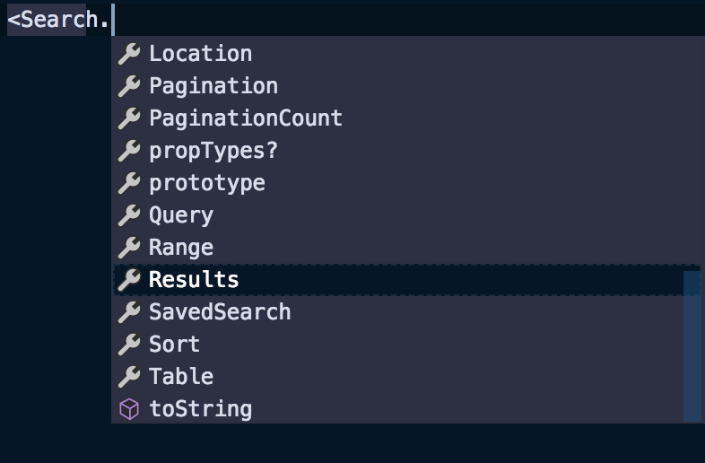
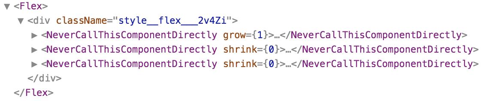
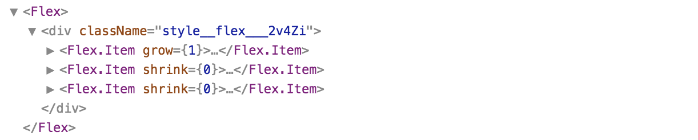

In a [previous post](https://democratizeopportunity.com/building-the-next-generation-of-search-at-handshake-67b69ffacecb)
and [React meetup](https://www.meetup.com/ReactJS-San-Francisco/events/243663563/),
I shared several patterns and tools for managing complex features with React and
TypeScript. Many of the code samples were using component dot notation, and I
briefly mentioned it but did not go in depth about the advantages of using this
approach.

This post will dive into those advantages when using component dot notation,
highlight a few gotchas, and provide some examples.

## What is component dot notation?

As the name suggests, it uses a "dot" to access the property of an object,
more commonly referred to as
[dot notation](https://developer.mozilla.org/en-US/docs/Web/JavaScript/Reference/Operators/Property_accessors#Dot_notation).
However, since this is at the component level (which are still just objects), I
prefer "component dot notation" for clarity. A quick example of this is
[React Context](https://reactjs.org/docs/context.html).

```tsx
const ThemeContext = React.createContext("light");

class App extends React.Component {
  render() {
    return (
      <ThemeContext.Provider value="dark">
        <ThemedButton />
      </ThemeContext.Provider>
    );
  }
}

function ThemedButton(props) {
  return (
    <ThemeContext.Consumer>
      {theme => <Button {...props} theme={theme} />}
    </ThemeContext.Consumer>
  );
}
```

In this example, `ThemeContext` is created and is the top-level component. Both
the `Provider` and `Consumer` are sub-components of `ThemeContext` accessed using
dot notation.

### Definitions

These terms will be used throughout the remainder of the post.

- **Top-level component:** the actual component that is imported
  (eg: `ThemeContext` or `Flex`). There is **only one** per set of components.
- **Sub-component:** any component accessed using dot notation
  (eg: `ThemeContext.Provider` or `Flex.Item`). There is **one or more** per set
  of components.
- **Component dot notation:** accessing sub-components from a top-level component
  using dot notation.

## Why use component dot notation?

There are a few key benefits I’ve experienced when using component dot notation
to both maintain and consume a set of components.

### ✏️ Namespacing

As a result of using component dot notation, all sub-components are inherently
namespaced by the top-level component. Let’s take a `Flex` component that wraps
CSS [flexbox](https://developer.mozilla.org/en-US/docs/Learn/CSS/CSS_layout/Flexbox)
as an example. The top-level component is named `Flex` with one sub-component:
`Flex.Item`.

```tsx
import { Flex } from "flex";

function User() {
  return (
    <Flex align="center">
      <Flex.Item shrink={0} grow={0}>
        <Avatar />
      </Flex.Item>
      <Flex.Item shrink={1} grow={1}>
        <UserInfo />
      </Flex.Item>
    </Flex>
  );
}
```

It does not enforce or stop usage of using `Flex.Item` outside of `Flex`, but
since it is a sub-component, it does imply to any developer that may be using it
that it should only be used as a child of `Flex`.

### 🚢 Single Imports

With this technique there is only a _single_ entry point to use the flex
components. It doesn’t matter if the `Flex.Item` component definition and logic
is in the same file as `Flex`, in a sibling file, or in a nested directory. The
underlying implementation and file structure can be changed at any time because
the only public contract is the export of `Flex`. This reduces the "public" API
surface area as compared to importing every component individually where a
change in implementation or file structure will break existing usages.

As a feature evolves over time and pieces are added and removed due to changing
requirements, the import can remain unchanged which can reduce noise in changes
to imports.

### 🔍 Discoverability

If there are **“n”** components in a set, a developer will have to memorize all
**“n”** of those component names to know which to import or go file spelunking
to find the component they need. However, with component dot notation,
only the top-level component needs to be remembered and all component options
will be suggested following the dot! There’s no need to memorize. This also
improves discoverability of _all_ components available that may not have been known.



<span class="image-caption">
Component dot notation typeahead example in VSCode
</span>

## Examples

There are various practical examples when component dot notation works well.
For example, wrapper components like `Flex` with `Flex.Item` as a sub-component.

```tsx
class Flex extends React.Component<Props> {
  public static Item = FlexItem;

  public render() {
    // ...
  }
}
```

Or slightly more complex components in a design system that maybe have several
building blocks. For example, a `Table` component that has many sub-components
such as `Table.Row`,`Table.Cell`, and `Table.Head` that can be used as children
only within `Table`.

```tsx
class Table extends React.Component<Props> {
  public static Body = TableBody;
  public static Cell = TableCell;
  public static Controls = TableControls;
  public static Head = TableHead;
  public static Header = TableHeader;
  public static Row = TableRow;

  public render() {
    // ...
  }
}
```

And lastly, it works great for large or complex sets of components, like a
`Search` feature, which has a variety of filter components, pagination, results,
etc.

```tsx
<Search category="Users">
  <Search.Filters>
    <Search.Query title="Search" placeholder="Enter a keyword..." />
    <Search.Facet title="Status" />
    <Search.DateRange title="Application Date" />
  </Search.Filters>
  <Search.PaginationCounter />
  <Search.Sort />
  <Search.Results
    component={UsersCard}
    renderEmpty={UsersNoResults}
    renderLoading={UsersLoading}
  />
</Search>
```

## Gotchas

There are a few "gotchas" you may stumble across that are worth being aware of
when using component dot notation.

### Higher Order Components

It can be tricky using a higher order component, such as `connect` from
`react-redux`, on the top-level component. Specifically when using `connect`,
[it will hoist all static attributes](https://github.com/reduxjs/react-redux/blob/fda9a015b6377cc59d0c0f1ec819057a099c1165/src/components/connectAdvanced.js#L299)
to the wrapping component (most higher order components do this), but the correct
**typings will not be preserved**. In this case, the higher order component will need
to be casted, or if possible, avoid using a higher order component with the
top-level component.

### Component Display Names

As discussed above, the underlying implementation of the sub-components does not
matter. In the case of `Flex` the `Flex.Item` component implementation itself
could be named `NeverCallThisComponentDirectly`. This is fine, but the only
downside is that in [React Devtools](https://github.com/facebook/react-devtools),
it will be shown as `NeverCallThisComponentDirectly,` which may be very
confusing because it was never called directly.



<span class="image-caption">
Example inspecting components with React Devtools using dot notation
</span>

One way around this is to set the
[`displayName`](https://reactjs.org/docs/react-component.html#displayname) on
the component to match how it will be used. In this case, the component name
remains `NeverCallThisComponentDirectly`, but now has a display name of `Flex.Item`.

```tsx
class NeverCallThisComponentDirectly extends React.Component<Props> {
  public static displayName = "Flex.Item";

  public render() {
    // ...
  }
}
```

The underlying implementation has not changed at all, but now the component is
both used as `Flex.Item` and correctly seen in React Devtools as `Flex.Item`.



<span class="image-caption">
Example of inspecting components with React Devtools using dot notation with a displayName
</span>

### Typing Function Components

All of the examples up to this point are using class components but this same
approach can be used with function components. However, it requires explicitly
declaring the sub-component in the type declaration.

```tsx
const Flex: React.FC<Props> & { Item: typeof FlexItem } = () => {
  // ...
};

Flex.Item = FlexItem;
```

This type declaration uses an intersection to combine the standard React function
component type with a type that declares the `Item` property. This then allows
assigning and later using `Flex.Item` in the same fashion as the class
components from above.

### Tree Shaking

One disadvantage of this approach is that it can "break" tree shaking. At a
high level, tree shaking works by removing code that is not imported nor used.
Since the top-level `Search` component imports and exposes all sub-components,
they will all be included even if never used. However, if this is an actual
problem it probably suggests an overuse of component dot notation or the
set of components are not related.

## Final thoughts

Component dot notation can be a useful technique when working with a set of
components. It minimizes the API surface area to a single export, keeps the
import simple and improves the discoverability of available sub-components.
