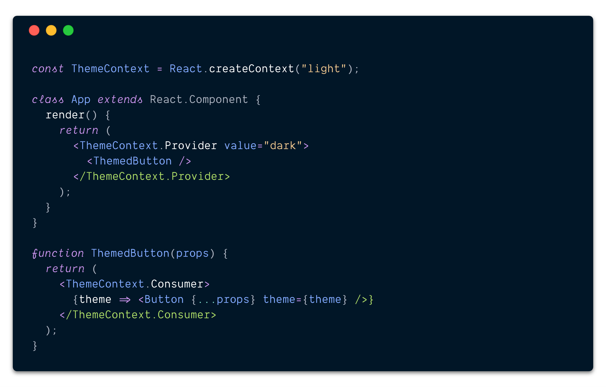
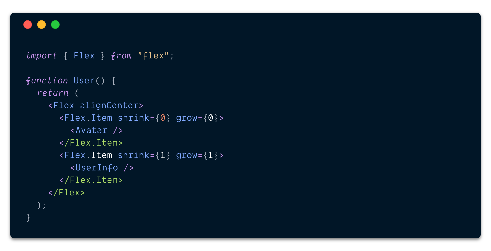
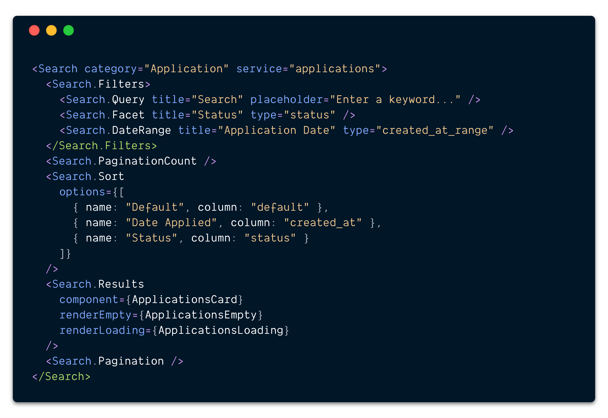
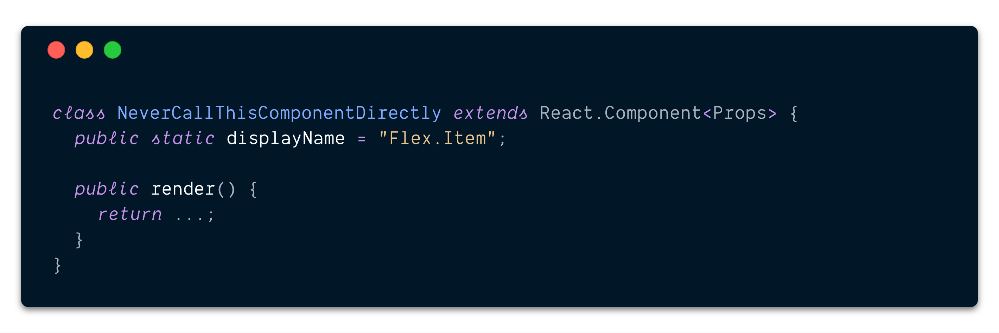

In a [previous post](https://democratizeopportunity.com/building-the-next-generation-of-search-at-handshake-67b69ffacecb) and [React meetup talk](https://www.meetup.com/ReactJS-San-Francisco/events/243663563/), I shared several patterns and tools for managing complex features with React and TypeScript. Many of the code samples were using component dot notation, and I briefly mentioned it but did not go in depth about the advantages of using this approach. This post will dive into the advantages of using component dot notation, highlight a few gotchas and provide some examples.

## What is component dot notation?

As the name suggests, it’s using a “dot” to access the property of an object, more commonly referred to as [dot notation](https://developer.mozilla.org/en-US/docs/Web/JavaScript/Reference/Operators/Property_accessors#Dot_notation). However, since this is at the component level (which are still just objects), I prefer “component dot notation” for clarity. A quick example of this is [React Context](https://reactjs.org/docs/context.html). `ThemeContext` is created and is the top-level component. Both the `Provider` and `Consumer` are then sub-components of `ThemeContext` accessed using dot notation.

A simple example of React Context using component dot notation

### Definitions

These terms will be used throughout the remainder of the post.

* **Top-level component:** the actual component that is imported (eg: `ThemeContext` or `Flex`). There is **only one** per set of components.

* **Sub-component:** any component accessed using dot notation (eg: `ThemeContext.Provider` or `Flex.Item`). There is **one or more** per set of components.

* **Component dot notation:** accessing sub-components from a top-level component using dot notation.

## Why use component dot notation?

There are three key benefits I’ve experienced when using component dot notation to both maintain and consume a set of components.

### ✏️ Namespacing

As a result of using component dot notation, all sub-components are inherently namespaced by the top-level component. Let’s take a `Flex` component that wraps CSS [flexbox](https://developer.mozilla.org/en-US/docs/Learn/CSS/CSS_layout/Flexbox) as an example. The top-level component is named `Flex` while it has only one sub-component, `Flex.Item`.

Example of React components wrapping flexbox

It does not enforce or stop usage of using `Flex.Item` outside of `Flex,` but since it is a sub-component, it does imply to any developer that may be using it that it should only be used as a child of `Flex`. Additionally, with this technique there is only a *single* entry point to use the flex components. It doesn’t matter if the `Flex.Item` component definition and logic is in the same file as `Flex`, in a sibling file or in a nested directory. The underlying implementation and file structure can be changed at any time because the only public contract is the export of `Flex`. This drastically reduces the “public” API surface area as compared to importing every component individually where a change in implementation or file structure will break existing usages.

### 🚢 Single Imports

As mentioned above, there is only a single imported component which is elegant and clean. Once the top-level component has been imported (eg: `import { Flex } from "flex"`) you never have to worry about adding or removing anything from this import statement. Depending on the number of components, this can save several lines at the top of the file. More importantly, as this feature evolves over time and pieces are added and removed due to changing requirements, the import remains entirely unchanged and reduces import noise in subsequent code reviews.

### 🔍 Discoverability

If there are **“n”** components in a set, a developer will have to memorize all **“n”** of those component names to know which to import or go file spelunking to find the component they actually need. However, with component dot notation, only the top-level component needs to be remembered and all component options will be suggested following the dot! There’s no need to memorize. This also improves discoverability of *all* components available that may not have been known.

Component dot notation typeahead example in VSCode

## Examples

There are various practical examples when component dot notation works well. For example, wrapper components like `Flex` with `Flex.Item` as a sub-component.

Example of the Flex top-level component with Flex.Item as a sub-component

Or slightly more complex components in a design system that maybe have several building blocks, like a `Table` component that has many sub-components such as `Table.Row`,`Table.Cell`, and `Table.Head` that can be used as children only within `Table`.

Example of the Table top-level component with many sub-components

And lastly, as mentioned in the [previous post](https://democratizeopportunity.com/building-the-next-generation-of-search-at-handshake-67b69ffacecb), it works great for large or complex sets of components, like a `Search` feature, which has a variety of filter components, pagination, results, etc.

Example of using a Search component with many sub-components

## Gotchas

There are two “gotchas” I have stumbled across when using component dot notation that are worth being aware of when using component dot notation.

### Higher Order Components

It can be tricky using a higher order component, such `connect` from `react-redux`, on the top-level component. Specifically when using `connect`, [it will hoist all static attributes](https://github.com/reduxjs/react-redux/blob/fda9a015b6377cc59d0c0f1ec819057a099c1165/src/components/connectAdvanced.js#L299) to the wrapping component (most higher order components do this), but the correct **typings will not be preserved**. In this case, the higher order component will need to be casted or more preferably, avoid using a higher order component with the top-level component.

### Component Display Names

As discussed above, the underlying implementation of the sub-components does not matter. In the case of `Flex` the `Flex.Item` component implementation itself could be named `NeverCallThisComponentDirectly`. This is great, but the only downside is that in [React Devtools](https://github.com/facebook/react-devtools), it will be shown as `NeverCallThisComponentDirectly,` which may be very confusing because it was never called directly.

Example inspecting components with React Devtools using dot notation

One way around this is to set the `[displayName`](https://reactjs.org/docs/react-component.html#displayname) on the component to match how it will be used. In this case, the component name remains `NeverCallThisComponentDirectly`, but now has a display name of `Flex.Item`.

Example of using displayName in a sub-component

Our underlying implementation has not changed at all, but now the component is both used as `&lt;Flex.Item /&gt;` and correctly seen in React Devtools as `Flex.Item`.

Example of inspecting components with React Devtools using dot notation with a displayName

## Final thoughts

Component dot notation can be a useful technique when working with a set of components. It minimizes the API surface area to a single export, keeps the import simple and drastically improves the discoverability of available sub-components.