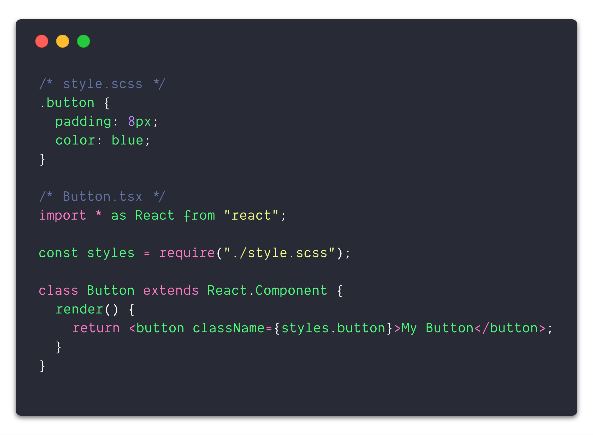

### 📦 What are CSS Modules?

As the name suggests, CSS Modules is a way to modularize styles into smaller pieces rather than massive global style sheets. Additionally, all class names are scoped locally by default and can be written in vanilla CSS, SCSS (my preference) or alternatives.

Example of a button component with CSS Modules.

It works well with a “pod” folder structure, where the styles and component implementation live within the same folder (pod). As seen in the example above, the component explicitly imports the styles it needs. The names are hashed so the class name `.button` could be used dozens of times in other style sheets without any naming conflicts.

Lastly, class names can be transformed. For example, I prefer to write CSS kebab case (eg: `.my-class-name`) but prefer referencing that class in JavaScript camel case (eg: `styles.myClassName`) both to follow conventions and `styles["my-class-name”]` is more tedious to type.

That’s it, there’s nothing _that_ special about CSS Modules, but these attributes encourage and enable maintainable styling with minimal complexity.

### 🥞 Flat styles & succinct names

It’s tedious and repetitive to create nested styles, but in the age of SCSS it’s no longer a concern. Classes can be arbitrarily nested without repeating the parent class name. Additionally, using `&` to reference the parent is quite handy. Although this solves the initial nesting problem, it can encourage deeply nested styles. This isn’t delightful to read but works fine, until just one style attribute needs to be overridden. Now a more specific (deeper nested) selector needs to be used, or something unthinkable like using `!important` (😱).

One solution to this problem is using a methodology like [BEM](http://getbem.com/introduction/) to structure styles, but this is reliant on every individual working on a project to follow the guidelines precisely, and still doesn’t guarantee there won’t be naming collisions. Moreover, this often results in long class names and encourages using overly “creative” class names to avoid naming collisions.

The majority of times nested styles are used to “namespace” styles. For example, `.header .button` may be used to style only buttons in a header section. Since CSS Modules automatically namespaces every class name, this eliminates the majority of use cases for nesting. As mentioned earlier, we can use `.button` in several style sheets without any concern of naming collisions. Without the concern of selector specificity or naming uniqueness styles are often “flat” with succinct, meaningful class names, not the third best available name or four layers of nesting.

### 🔥 Remove dead styles with confidence

What’s more satisfying than writing a new feature? _Burning dead code_. What’s the hardest part about removing a feature? _Knowing what styles are safe to remove with 100% confidence_.

In the example above, there is an explicit dependency between the styles and the component. If this component needs to use any of the styles it must import them directly with `const styles = require("./style.scss");`. With the pod approach, there is generally a one-to-one mapping between a style sheet and a component so the entire pod can be removed with no need to hunt down dead styles. There are always exceptions, say for whatever reason a style sheet is being used in many components. Rather than hunting down those imports, the build will fail because the file trying to be imported no longer exists. It is almost impossible to accidentally delete styles, or leave dead styles around.

### 👩‍💻 Optimal developer experience

CSS-in-JS solutions (such as [styled-components](https://github.com/styled-components/styled-components) or [emotion](https://github.com/emotion-js/emotion)) are popular and offer many of the same advantages. However, they introduce a steeper learning curve and require more time to understand.

With CSS Modules it’s vanilla CSS or SCSS, technologies people have been using for years. The only difference is many smaller files living where they are used. This makes it even easier to make edits rather than hunting down the applicable styles in a large style sheet several directories away without the concern of breaking the styles of another component. Furthermore, SCSS can still be used to leverage features like shared variables, nesting and others. As with any good tool, there needs to be an opt-out. The `:global` syntax offers the ability to opt-out of namespacing and apply styles globally. I would consider this _almost_ equivalent to using `!important`, but is useful on rare occasion.

Overall, there’s almost no learning curve for those with any CSS experience and almost no onboarding cost to understand the styling framework because the styles live directly where they are used.

### 🧢 Recap

CSS Modules is not an earth-shattering concept, but is just the right amount of new mixed with the old. It offers modularization of styles, encourages thoughtful naming, flattens styles, guarantees safe removal of styles, and improved editing without the learning the curve.
