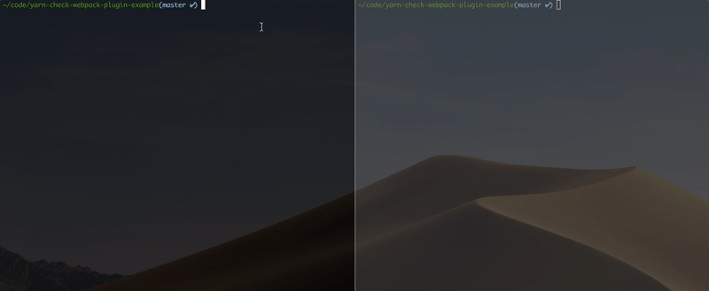

When working in a codebase with a large number of contributors, it's likely
npm packages will be getting added or upgraded over time. The next time
another person pulls those changes they may forget to run
`yarn install`. They start up webpack _(assuming that's the build tool of choice)_
or maybe never restarted it when switching between git branches. This might
result in a webpack build error with something like the following.

```
ERROR in ./src/index.ts
Module not found: Error: Can't resolve 'lodash'.
 @ ./src/index.ts
```

However, this is probably one of the easier ones to understand that a package
is probably missing. If using TypeScript others might look like one of the
following.

```
TS2554: Expected 1-2 arguments, but got 3.
```

```
TS7016: Could not find a declaration file for module 'lodash'.
'node_modules/lodash/lodash.js' implicitly has an 'any' type.
```

These are only a sample of many possible errors that are all the result
of either missing or incorrect versions (due to breaking changes). These can
be particularly misleading and cryptic when not making any related changes
leading to time wasted trying to understand what's wrong and usually resolving
with a `yarn install`. What if there was a way to explicitly error with
missing or incorrect packages?

## A webpack plugin to verify packages

There was the [`npm-install-webpack-plugin`](https://github.com/webpack-contrib/npm-install-webpack-plugin)
that could automatically install dependencies with `npm` but it unfortunately
[doesn't support webpack 4](https://github.com/webpack-contrib/npm-install-webpack-plugin/issues/122).

Looking at other tools, [webpacker handles outdated packages](https://github.com/rails/webpacker/blob/8845f37bb038ad0adff813326a7d6a034b9b9a81/lib/webpacker/railtie.rb#L16-L51) on start and exits. What about long running webpack
process and switching between branches?

The intent of the [`yarn-check-webpack-plugin`](https://github.com/skovy/yarn-check-webpack-plugin)
is to help solve this issue. It can be added to the webpack configuration as a
plugin to run during each build and will print warnings with a prompt to
run the proper command to install missing or incorrect packages.

To get started, install the package.

```bash
yarn add -D yarn-check-webpack-plugin
```

Then, add it to the webpack configuration's list of plugins.

```javascript{3,7}
// webpack.config.js (JavaScript)

const { YarnCheck } = require("yarn-check-webpack-plugin");

module.exports = {
  // Additional configuration...
  plugins: [new YarnCheck()]
};
```

```typescript{4,8}
// webpack.config.ts (TypeScript)

import * as webpack from "webpack";
import { YarnCheck } from "yarn-check-webpack-plugin";

const config: webpack.Configuration = {
  // Additional configuration...
  plugins: [new YarnCheck()]
};

module.exports = config;
```

Now, starting the webpack process should print any missing or incorrect packages.
There are also a [few configuration options](https://github.com/skovy/yarn-check-webpack-plugin/blob/master/README.md#configuration)
depending on the use case.

## How does it work?

For example, say a webpack watch process is running and started on the `master`
branch. In the process of working or reviewing code the branch `add-underscore`
is checked out (`git checkout add-underscore`). In this case, the branch name
gives it away, but sometimes it's not immediately obvious that a package was
added or changed. This plugin will list the differences between the installed
versus expected packages. In this specific example, the `forceKill` option is
enabled so the webpack process also exits.



See a higher quality version of this [gif in the project's README](https://github.com/skovy/yarn-check-webpack-plugin/blob/master/README.md).

This check is done using the [`yarn check --verify-tree`](https://yarnpkg.com/lang/en/docs/cli/check/#toc-yarn-check-verify-tree) command.

## Conclusion

Have you ran into cryptic errors with webpack that are fixed with a `yarn install`?
Give the [`yarn-check-webpack-plugin`](https://github.com/skovy/yarn-check-webpack-plugin)
a shot!

If you have ideas for improvements or feedback [let me know on GitHub](https://github.com/skovy/yarn-check-webpack-plugin/issues/new).
